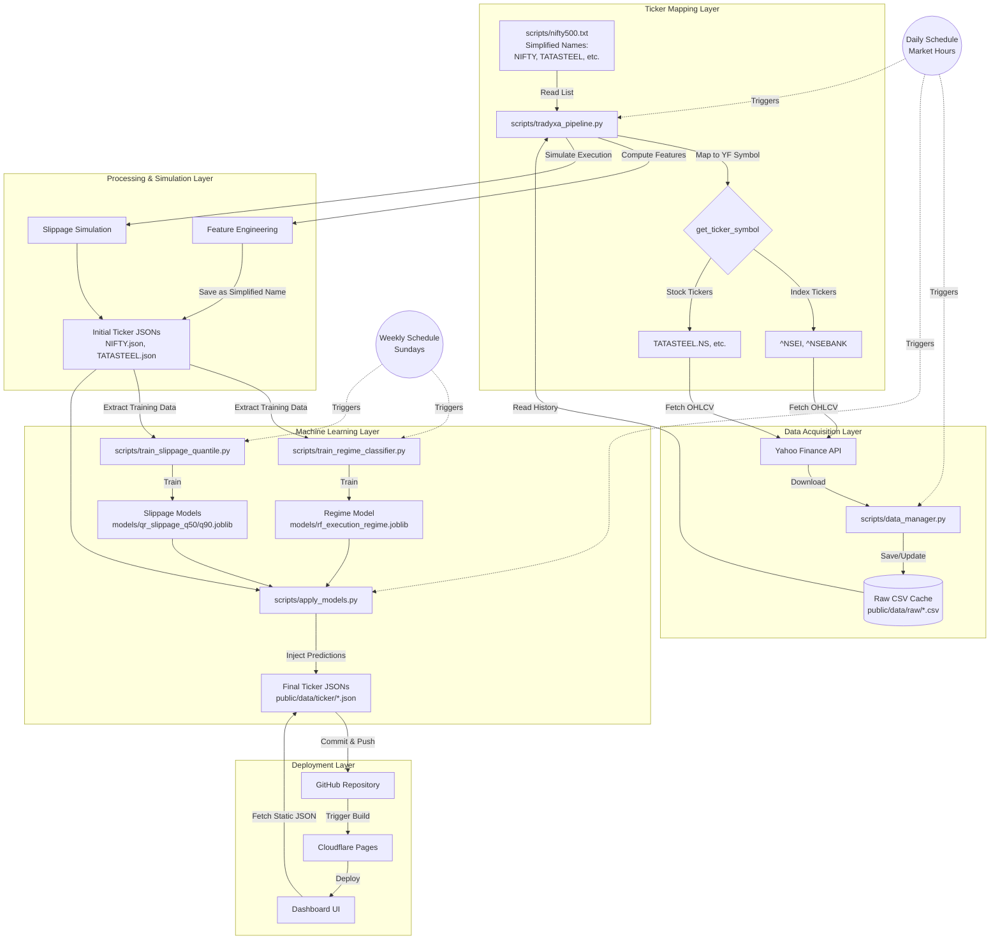

# Tradyxa Aztryx Architecture

This document outlines the end-to-end data pipeline, from raw data acquisition to machine learning model application and dashboard deployment.

## Data Pipeline Overview

## Detailed Process Flow

### 1. Ticker Symbol Mapping (`scripts/tradyxa_pipeline.py`)
*   **Source**: The ticker list is maintained in `scripts/nifty500.txt` with **simplified, human-readable names**:
    *   Indices: `NIFTY`, `BANKNIFTY` (not `^NSEI`, `^NSEBANK`)
    *   Stocks: `TATASTEEL`, `CHAMBLFERT` (not `TATASTEEL.NS`, `CHAMBLFERT.NS`)
*   **Mapping Logic** (`get_ticker_symbol` function):
    *   **Index Tickers**: Uses `INDEX_TICKER_MAP` to convert simplified names to Yahoo Finance symbols:
        *   `NIFTY` → `^NSEI`
        *   `BANKNIFTY` → `^NSEBANK`
    *   **Stock Tickers**: Automatically appends `.NS` suffix for NSE (National Stock Exchange) stocks:
        *   `TATASTEEL` → `TATASTEEL.NS`
        *   `CHAMBLFERT` → `CHAMBLFERT.NS`
*   **Data Flow**:
    1. Read simplified ticker from `nifty500.txt` (e.g., `TATASTEEL`)
    2. Map to yfinance symbol internally (e.g., `TATASTEEL.NS`)
    3. Fetch data from Yahoo Finance using the mapped symbol
    4. Save JSON file using the **original simplified name** (e.g., `TATASTEEL.json`)
*   **Frontend Contract**: The frontend (`client/src/data/tickers.ts`) uses the **simplified names** to fetch JSON files, ensuring consistency across the stack.

### 2. Data Fetching & Storage (`scripts/data_manager.py`)
*   **Source**: Fetches historical OHLCV data (Open, High, Low, Close, Volume) from Yahoo Finance (`yfinance`).
*   **Caching**: Stores data in **CSV format** in `public/data/raw/{ticker}.csv`.
*   **Incremental Updates**:
    *   Checks if a CSV exists for the ticker.
    *   If yes, reads the last timestamp and fetches only *new* data since then.
    *   Appends new data to the CSV, ensuring a continuous 5-year history without re-downloading everything.
    *   If no CSV exists, fetches the full 5-year history.

### 3. Pipeline Processing (`scripts/tradyxa_pipeline.py`)
*   **Input**: Reads the local CSV files managed by `data_manager.py`.
*   **Feature Engineering**: Computes quantitative metrics:
    *   **Amihud Illiquidity**: Measure of price impact per unit of volume.
    *   **Market Friction Coefficient (MFC)**: Rolling volatility-to-volume ratio.
    *   **Lambda**: Price impact proxy based on covariance of price changes and volume.
    *   **Coordinated Flow**: Correlation between volume surges and directional price moves.
*   **Slippage Simulation**:
    *   Runs deterministic and Monte Carlo simulations to estimate slippage for various trade sizes (100k, 250k, 500k, 1M INR).
    *   Generates distribution statistics (Median, 90th Percentile).
*   **Output**: Generates "Initial" JSON files in `public/data/ticker/{ticker}.json` using the **simplified ticker name**. These contain the computed metrics and features but *not yet* the ML predictions.

### 4. Model Training (Weekly)
Triggered by GitHub Actions (`.github/workflows/train.yml`) once a week.

*   **Regime Classifier (`scripts/train_regime_classifier.py`)**:
    *   **Input**: Reads all generated Ticker JSONs.
    *   **Logic**: Uses historical slippage statistics (p90) to label market conditions as LOW, NORMAL, HIGH, or SEVERE.
    *   **Training**: Trains a **RandomForest Classifier** to predict these regimes based on market features (Amihud, Volatility, etc.).
    *   **Output**: Saves the trained model to `models/rf_execution_regime.joblib`.

*   **Slippage Forecaster (`scripts/train_slippage_quantile.py`)**:
    *   **Input**: Reads all generated Ticker JSONs.
    *   **Logic**: Uses historical median and p90 slippage values as targets.
    *   **Training**: Trains **Quantile Regression Models** (Gradient Boosting) to forecast the median (Q50) and tail risk (Q90) slippage.
    *   **Output**: Saves models to `models/qr_slippage_q50.joblib` and `models/qr_slippage_q90.joblib`.

### 5. Model Application (`scripts/apply_models.py`)
Runs immediately after the pipeline in the daily update cycle.

*   **Input**: Loads the trained `.joblib` models and the Initial Ticker JSONs.
*   **Prediction**:
    *   Feeds the latest market features for each ticker into the models.
    *   **Regime Model**: Predicts the current market regime (e.g., "HIGH Friction").
    *   **Slippage Model**: Forecasts expected slippage for the next trade.
*   **Output**: Updates the Ticker JSONs in-place, adding fields like `ml_regime_label`, `ml_regime_prob`, `predicted_median`, and `predicted_p90`.

### 6. Deployment & Consumption
*   **Commit**: The updated JSON files are committed to the GitHub repository by the GitHub Action.
*   **Build**: Cloudflare Pages detects the commit and rebuilds the static site.
*   **Frontend**: The Next.js dashboard fetches these static JSON files at runtime (or build time) to populate the tiles.
    *   **Verdict Tile**: Uses the ML predictions to adjust its confidence score and recommendation.
    *   **Slippage Tile**: Displays the ML-forecasted slippage alongside historical simulations.
