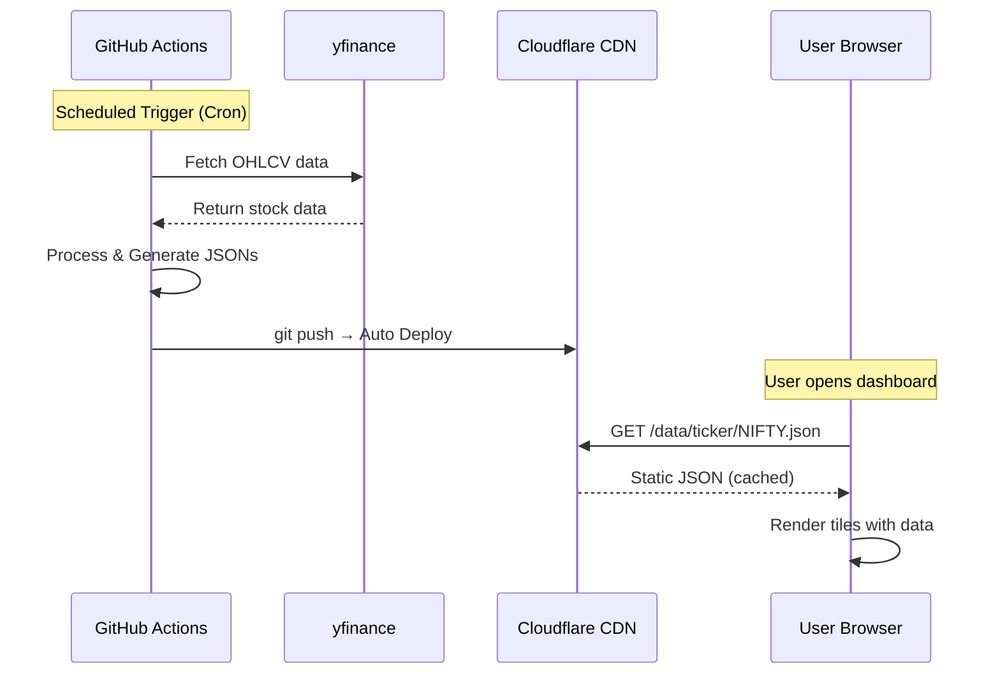
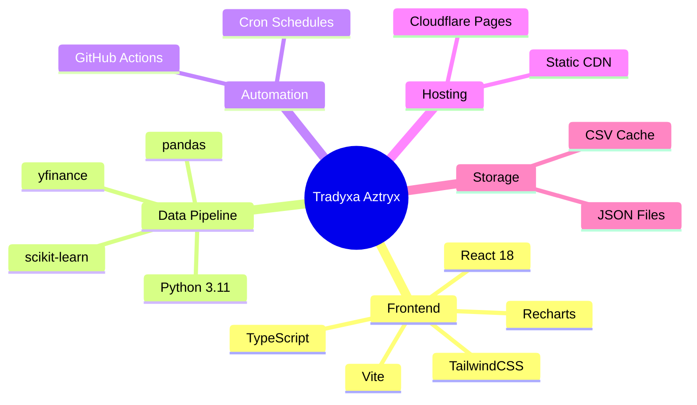

# Tradyxa Aztryx - Architecture Overview

## Classification: **Static-First Jamstack Web App**

This is a **static web application** with **dynamic data updates via CI/CD**.

| Aspect | Classification |
|--------|----------------|
| **Frontend** | Static (React SPA) |
| **Backend** | None (serverless) |
| **Data** | Pre-computed JSON (static files) |
| **Updates** | GitHub Actions (automated) |
| **Hosting** | Cloudflare Pages (static CDN) |

---

## Architecture Type

```mermaid
flowchart TB
    subgraph "Data Pipeline (GitHub Actions)"
        A[yfinance API] -->|Daily 3:45 PM| B[Python Scripts]
        B -->|Generate| C[Static JSON Files]
        C -->|git push| D[GitHub Repository]
    end
    
    subgraph "Deployment (Cloudflare)"
        D -->|Auto Deploy| E[Cloudflare Pages CDN]
    end
    
    subgraph "User Browser (Static)"
        E -->|Serve| F[React SPA]
        F -->|fetch| G[/data/ticker/*.json]
        G -->|Display| H[Dashboard Tiles]
    end
```

---

## How It Works



---

## Static vs Dynamic Comparison

| Feature | Static (This Project) | Dynamic (Traditional) |
|---------|----------------------|----------------------|
| **Server** | ❌ None needed | ✅ Required |
| **Database** | ❌ JSON files | ✅ SQL/NoSQL |
| **Real-time** | ⏱️ Every 2 hours | ⚡ Instant |
| **Cost** | 💰 Free | 💸 Paid hosting |
| **Scaling** | ∞ CDN auto-scales | 🔧 Manual |
| **Complexity** | 🟢 Simple | 🔴 Complex |

---

## Why Static-First?

1. **Zero hosting cost** - Cloudflare Pages free tier
2. **Infinite scale** - CDN handles traffic automatically  
3. **No maintenance** - No servers to patch/update
4. **Fast globally** - CDN edge locations worldwide
5. **Resilient** - No server failures possible

---

## Data Freshness

| Data Type | Update Frequency | Method |
|-----------|------------------|--------|
| Spot Prices | Every 2 hours | `live_spot_prices.yml` |
| OHLCV History | Daily 3:45 PM | `daily_update.yml` |
| ML Predictions | Weekly Sunday 2 AM | `weekly-pipeline.yml` |
| Timeline Events | Weekly | `weekly-pipeline.yml` |

---

## Tech Stack Summary


