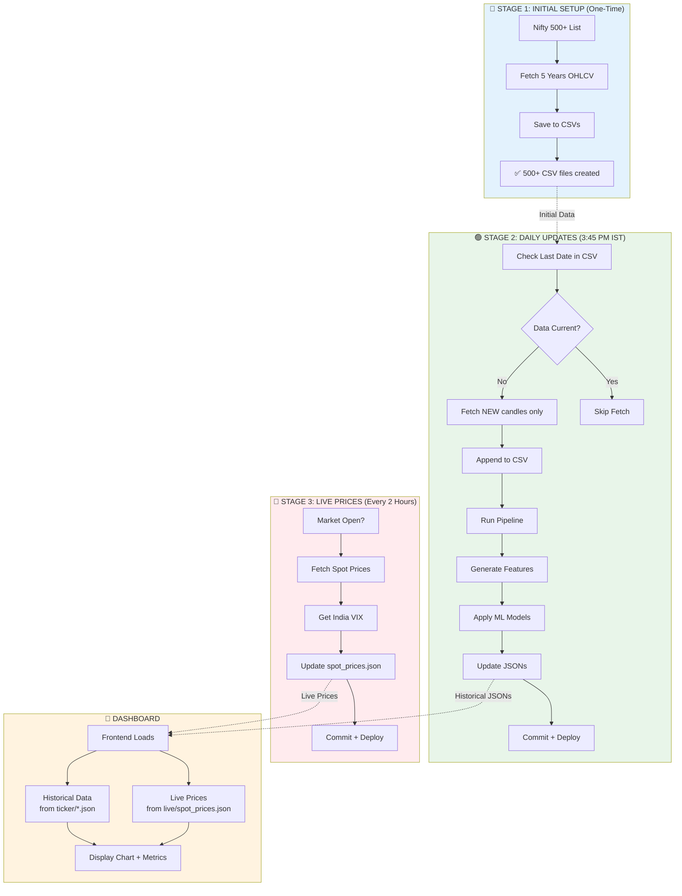
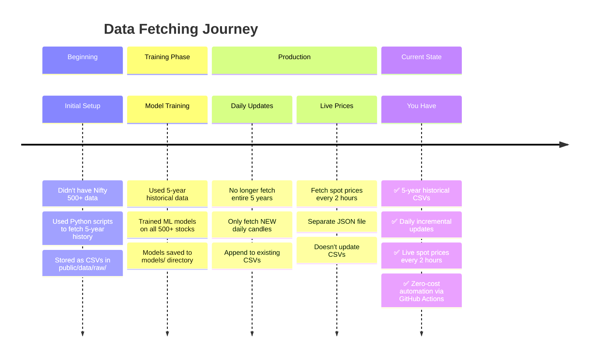

# Data Fetching Architecture - Tradyxa Aztryx

## Overview

This document explains how data is fetched, stored, and updated in the Tradyxa Aztryx project across different stages.

---

## Three Stages of Data Fetching

### Stage 1: Initial Historical Data (One-Time Setup) ✅ COMPLETED

**What:** Fetched 5 years of historical OHLCV data for all 500+ Nifty stocks

**When:** At the beginning of the project (one-time)

**Purpose:** To train ML models with sufficient historical data

**Implementation:**
- Used `data_manager.py` with `fetch_and_update_data(ticker, period="5y")`
- Fetched data for all tickers from `scripts/nifty500.txt`
- Stored as CSV files in `public/data/raw/`
- Files: `NSEI.csv`, `NSEBANK.csv`, and 500+ individual stock CSVs

**Status:** ✅ You have all 5-year historical data now as CSVs

---

### Stage 2: Daily OHLCV Updates (Incremental) 🔄 ONGOING

**What:** Fetch only NEW daily candles (OHLCV data) since last update

**When:** Once per day after market close (3:45 PM IST / 10:15 AM UTC)

**Purpose:** Keep historical data up-to-date without re-fetching entire 5-year history

**Implementation:**
- GitHub Action: `.github/workflows/daily_update.yml`
- Runs Monday-Friday at 10:15 AM UTC (3:45 PM IST)
- Uses `data_manager.py` smart incremental fetching:
  
```python
# data_manager.py logic:
# 1. Load existing CSV for ticker
# 2. Check last date in CSV
# 3. If data is current → skip fetch
# 4. If data is stale → fetch only from (last_date + 1 day) to today
# 5. Append new rows to existing CSV
# 6. Save updated CSV
```

**Files Updated:**
- `public/data/raw/*.csv` (appends new rows only)
- `public/data/ticker/*.json` (full regeneration with new features)

**Workflow Steps:**
1. Fetch incremental OHLCV for all 500+ tickers
2. Run pipeline to generate features and JSONs
3. Apply ML models for predictions
4. Commit to GitHub → triggers Cloudflare deployment

**Cost:** ~1 GitHub Actions run per day (5 runs/week)

---

### Stage 3: Live Spot Price Updates (Real-Time) 🔴 ONGOING

**What:** Fetch ONLY current spot prices (not historical data, just live price)

**When:** Every 2 hours during market hours (4 runs per day)

**Purpose:** Show real-time price movements on dashboard without updating historical CSVs

**Implementation:**
- GitHub Action: `.github/workflows/live_spot_prices.yml`
- Runs at: 4:00, 6:00, 8:00, 10:00 AM UTC (during market hours)
- Uses `scripts/fetch_spot_prices.py`

**What Gets Fetched:**
- Current spot price for all 500+ tickers
- Price change percentage
- India VIX (volatility index)
- Timestamp

**Files Updated:**
- ONLY `public/data/live/spot_prices.json`
- Does NOT touch CSV files
- Does NOT update historical data

**Output Format:**
```json
{
  "last_updated": "2025-12-04T10:30:00",
  "india_vix": {
    "vix": 15.23,
    "timestamp": "2025-12-04T10:30:00"
  },
  "spot_prices": {
    "RELIANCE.NS": {
      "ticker": "RELIANCE.NS",
      "spot_price": 2456.75,
      "change_percent": 1.23,
      "timestamp": "2025-12-04T10:30:00"
    }
    // ... 500+ more tickers
  }
}
```

**Cost:** ~4 GitHub Actions runs per day (20 runs/week)

---

## Data Storage Structure

```
public/
├── data/
│   ├── raw/                          # Historical OHLCV (CSV)
│   │   ├── NSEI.csv                  # 5 years + daily updates
│   │   ├── NSEBANK.csv               # 5 years + daily updates
│   │   └── [500+ stock CSVs]         # 5 years + daily updates
│   │
│   ├── ticker/                       # Features + Predictions (JSON)
│   │   ├── ^NSEI.json               # Daily regenerated
│   │   ├── ^NSEBANK.json            # Daily regenerated
│   │   └── [500+ stock JSONs]       # Daily regenerated
│   │
│   └── live/                         # Real-time Spot Prices (JSON)
│       └── spot_prices.json         # Updated every 2 hours
```

---

## Data Flow Architecture



---

## Weekly Model Training (Bonus Stage)

**What:** Retrain ML models on updated data

**When:** Every Sunday at midnight UTC

**Why:** Improve model accuracy as more market data accumulates

**Implementation:**
- GitHub Action: `.github/workflows/train.yml`
- Fetches all data (uses existing CSVs + incremental updates)
- Trains 3 global models:
  - Regime Classifier (RandomForest)
  - Slippage Q50 Forecaster (GradientBoosting)
  - Slippage Q90 Forecaster (GradientBoosting)
- Saves models to `models/*.joblib`
- Commits with `[skip ci]` to avoid triggering deployment

**Cost:** ~1 GitHub Actions run per week

---

## GitHub Actions Schedule Summary

| Workflow | Frequency | Time (IST) | Time (UTC) | Purpose | Weekly Runs |
|----------|-----------|------------|------------|---------|-------------|
| **Train ML Models** | Weekly | Sunday 5:30 AM | Sunday 0:00 | Retrain models | 1 |
| **Daily Dashboard Update** | Daily (Mon-Fri) | 3:45 PM | 10:15 AM | Update OHLCV + regenerate JSONs | 5 |
| **Live Spot Prices** | Every 2 hours (Mon-Fri) | 9:45 AM, 11:45 AM, 1:45 PM, 3:30 PM | 4:00, 6:00, 8:00, 10:00 AM | Fetch live prices only | 20 |

**Total GitHub Actions Runs:** ~26 runs per week (well within free tier of 2,000 minutes/month)

---

## Key Differences: Your Original Question Answered ✅

### ❌ You DON'T Need:
- **Re-fetch entire 5-year history** ← Already done, stored in CSVs
- **Spot prices every 30 minutes** ← Optimized to every 2 hours for zero-cost

### ✅ You DO Have:
1. **Initial 5-year data** (500+ stocks) → Stored in `public/data/raw/*.csv`
2. **Daily incremental updates** → Only fetch new candles, append to CSVs
3. **Live spot prices every 2 hours** → Separate JSON file, doesn't touch CSVs

---

## Smart Incremental Fetching Logic

The `data_manager.py` module implements intelligent caching:

**First Run (No CSV exists):**
```
Fetch full 5 years → Save to CSV
```

**Subsequent Runs (CSV exists):**
```
1. Load existing CSV
2. Get last date: 2025-12-03
3. Today's date: 2025-12-04
4. Fetch only: 2025-12-04 (1 day of data)
5. Append to CSV
6. Save updated CSV
```

**Result:** You NEVER re-download 5 years again!

---

## Cost Optimization Features

### Zero-Cost Architecture:
1. **Reduced spot price frequency:** 2 hours instead of 30 minutes (4 runs vs 13 runs/day)
2. **Skip CI on training:** `[skip ci]` prevents unnecessary builds
3. **Incremental fetching:** Only fetch new data, not entire history
4. **Batch processing:** Limit concurrent workers to avoid rate limits

### Free Tier Usage:
- **GitHub Actions:** ~26 runs/week × ~5 min avg = 130 min/week (~520 min/month)
  - Well under 2,000 min/month free tier
- **Cloudflare Pages:** Static frontend hosting (free 500 builds/month)
  - ~25 deployments/week = 100/month

---

## Summary: The Evolution



---

## Files Reference

| File | Purpose | Updates |
|------|---------|---------|
| `scripts/data_manager.py` | Smart incremental OHLCV fetching | Daily |
| `scripts/fetch_spot_prices.py` | Live spot price fetching | Every 2 hours |
| `scripts/tradyxa_pipeline.py` | Feature engineering + JSON generation | Daily |
| `scripts/apply_models.py` | Apply ML predictions to JSONs | Daily |
| `scripts/train_regime_classifier.py` | Train regime model | Weekly |
| `scripts/train_slippage_quantile.py` | Train slippage models | Weekly |
| `public/data/raw/*.csv` | Historical OHLCV (5y + incremental) | Daily |
| `public/data/ticker/*.json` | Features + predictions | Daily |
| `public/data/live/spot_prices.json` | Current prices + VIX | Every 2 hours |

---

## Your Understanding is Correct! ✅

> "At the beginning I didn't have Nifty 500+ stocks, the Python scripts helped to fetch it, then I didn't need it."

**✅ Correct!** Initial 5-year fetch was one-time.

> "Now I asked Nifty 500+ last 5 year old data for all 500+ stocks to train models, am I right?"

**✅ Correct!** You fetched 5 years to have enough data for ML training.

> "Since I got all those last 5 year old data as CSV, I just need the daily OHLCV data updated rather than the entire data being fetched again."

**✅ Correct!** Daily updates only fetch NEW candles, append to CSVs.

> "Then I need spot prices fetched every 30 mins for all 500+ data."

**⚠️ Optimized!** Currently set to every 2 hours (not 30 min) to stay within GitHub Actions free tier. You can change this if needed, but it will increase costs.

---

## Need to Change Spot Price Frequency?

If you want to fetch spot prices more frequently (e.g., every 30 minutes), edit:

**File:** `.github/workflows/live_spot_prices.yml`

**Current (every 2 hours):**
```yaml
cron: "0 4,6,8,10 * * 1-5"  # 4 runs/day
```

**Change to (every 30 minutes - example):**
```yaml
cron: "*/30 3-10 * * 1-5"  # ~14 runs/day during market hours
```

**Impact:** 14 runs/day × 5 days = 70 runs/week (still within free tier)
