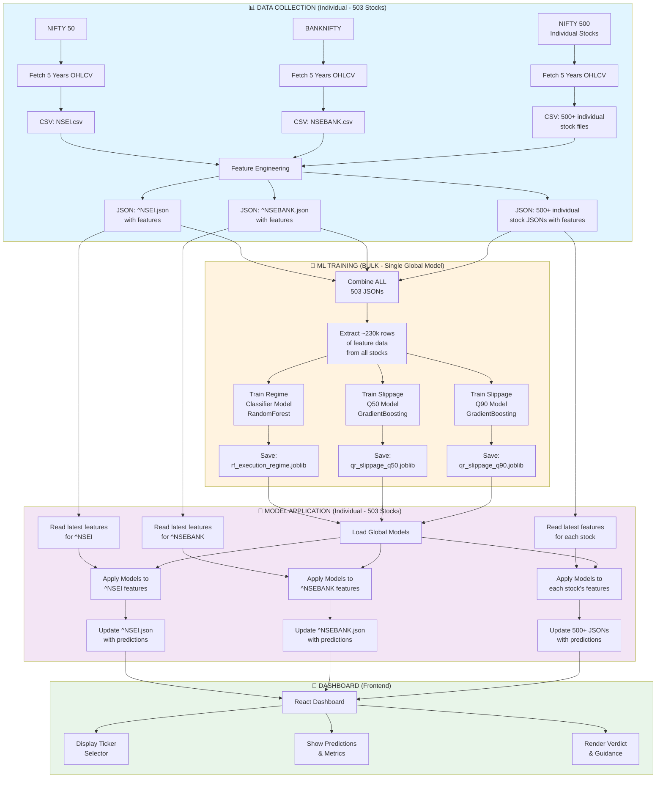

# Tradyxa Aztryx - ML Training & Data Flow Architecture

## Overview

The system uses **BULK/GLOBAL training** (one model for all stocks) rather than individual per-stock models.

---

## Complete Data Flow Diagram

---

## Key Points

### 1. **Data Collection: INDIVIDUAL** ✅
- Each of the 503 stocks is processed separately
- 5 years of OHLCV data fetched per stock
- Features computed individually for each stock
- Stored in separate JSON files

### 2. **ML Training: BULK/GLOBAL** ✅
- **All 503 stocks' data is COMBINED**
- Creates one large dataset (~230,000 rows from all stocks)
- Trains **3 global models** that learn patterns across *all* stocks:
  - 1 Regime Classifier
  - 2 Slippage models (Q50 & Q90)
- These models understand market behavior from ALL stocks collectively

### 3. **Model Application: INDIVIDUAL** ✅
- The trained global models are applied to **each stock separately**
- Each stock gets predictions based on its own latest features
- Updates happen to individual JSON files

### 4. **Dashboard: USER SELECTION** ✅
- Frontend reads individual stock JSONs
- User selects which ticker to view
- Dashboard displays predictions for that specific stock

---

## Why Global Models?

1. **Market patterns are universal**: Slippage and regime behaviors are similar across stocks
2. **Better generalization**: Learning from 500+ stocks makes models more robust
3. **Efficiency**: 3 models instead of 1,509 models (3 per stock × 503)
4. **Shared knowledge**: Low-volume stocks benefit from patterns in high-volume stocks

---

## Training vs Inference Timeline

| Stage | Frequency | Scope |
|-------|-----------|-------|
| Data Collection | Daily | Individual (503 stocks) |
| ML Training | Weekly | Bulk (all stocks combined) |
| Model Application | Daily (after training) | Individual (503 stocks) |
| Dashboard Display | Real-time | Per user selection |
