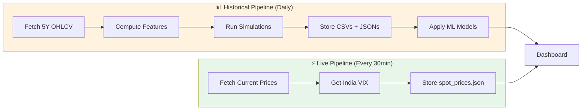

# Dual-Data Architecture

This project uses a **dual-data strategy** to balance real-time updates with efficient model training.

---

## **Two Data Pipelines**

### 1. **Historical OHLCV Data** (Heavy, Infrequent)
**Purpose**: Train ML models on 5 years of historical data

**Scripts**: 
- `data_manager.py`
- `tradyxa_pipeline.py`

**Storage**: 
- `public/data/raw/*.csv` (OHLCV history)
- `public/data/ticker/*.json` (Features + ML predictions)

**Frequency**: Once daily after market close (3:45 PM IST)

**Size**: ~240 MB (5 years × 503 stocks)

**Workflow**: `.github/workflows/daily_update.yml`

---

### 2. **Live Spot Prices** (Lightweight, Frequent)
**Purpose**: Display real-time prices on dashboard during market hours

**Script**: 
- `fetch_spot_prices.py`

**Storage**: 
- `public/data/live/spot_prices.json` (Current prices only)

**Frequency**: Every 30 minutes (9:15 AM - 3:30 PM IST, Mon-Fri)

**Size**: ~50 KB (current price for 503 stocks + India VIX)

**Workflow**: `.github/workflows/live_spot_prices.yml`

---

## **Data Flow Comparison**



---

## **Dashboard Usage**

Your React dashboard should:

1. **On Load**:
   - Read `public/data/ticker/<TICKER>.json` for full analysis, features, and verdict
   
2. **Every 30 Seconds** (polling or WebSocket):
   - Read `public/data/live/spot_prices.json` for current prices and India VIX
   - Update spot price display
   - Update VIX tile

---

## **File Structure**

```
public/data/
├── raw/                          # Historical OHLCV (CSV, ~240 MB)
│   ├── RELIANCE_NS.csv           # 5 years of daily data
│   ├── TCS_NS.csv
│   └── ...
├── ticker/                       # Full analysis (JSON, ~200 MB)
│   ├── RELIANCE.NS.json          # Features + ML predictions + verdict
│   ├── TCS.NS.json
│   └── ...
└── live/                         # Real-time data (JSON, ~50 KB)
    └── spot_prices.json          # Current prices + India VIX
```

---

## **Example: spot_prices.json**

```json
{
  "last_updated": "2025-12-01T11:45:00",
  "india_vix": {
    "vix": 15.23,
    "timestamp": "2025-12-01T11:45:00"
  },
  "spot_prices": {
    "^NSEI": {
      "ticker": "^NSEI",
      "spot_price": 24350.50,
      "change_percent": 0.85,
      "timestamp": "2025-12-01T11:45:00"
    },
    "^NSEBANK": {
      "ticker": "^NSEBANK",
      "spot_price": 51200.30,
      "change_percent": -0.42,
      "timestamp": "2025-12-01T11:45:00"
    },
    "RELIANCE.NS": {
      "ticker": "RELIANCE.NS",
      "spot_price": 2850.75,
      "change_percent": 1.20,
      "timestamp": "2025-12-01T11:45:00"
    }
  }
}
```

---

## **GitHub Actions Cost**

### Updated Monthly Usage:

| Workflow | Frequency | Time per Run | Monthly Minutes |
|----------|-----------|--------------|-----------------|
| Live Spot Prices | 30 min × 6.5 hrs × 22 days | 5 min | **715 minutes** |
| Daily Data Update | 1× daily × 22 days | 35 min | **770 minutes** |
| Weekly Training | 1× weekly × 4 weeks | 20 min | **80 minutes** |
| **Total** | | | **~1,565 minutes** |

⚠️ **Exceeds free tier** (2,000 minutes, but only slightly)

**Optimization**: Consider reducing live updates to every hour (saves ~550 minutes/month)

---

## **Benefits**

✅ **Faster dashboard loads**: Spot prices are only 50 KB vs 200+ MB of full data  
✅ **Real-time feel**: Updates every 30 minutes during market hours  
✅ **Efficient training**: Full historical data only processed once daily  
✅ **Cloudflare friendly**: Small, frequent deployments for live data
