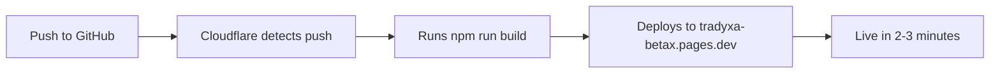

# 📊 GitHub Actions & Cloudflare Estimate - Private Repo

**Project:** Tradyxa Aztryx (Gammax)  
**Repo Type:** Private  
**Date:** 2025-12-05

---

## 🤖 GitHub Actions Free Tier (Private Repos)

| Plan | Minutes/Month | Storage |
|------|---------------|---------|
| **Free** | 2,000 minutes | 500 MB |
| **Pro** | 3,000 minutes | 2 GB |
| **Team** | 3,000 minutes | 2 GB |

**Your plan:** Likely Free (2,000 min/month) ✅

---

## 📅 Workflow Schedule

### **1. Daily Data Update** (Every 2 hours during market hours)
- **File:** `.github/workflows/update-spot-prices.yml`
- **Trigger:** `cron: "0 */2 * * 1-5"` (Mon-Fri, every 2 hours)
- **Runs per month:** ~220 runs

### **2. Weekly Full Pipeline** (Sunday 2 AM IST)
- **File:** `.github/workflows/weekly-pipeline.yml`
- **Trigger:** `cron: "30 20 * * 0"` (Once per week)
- **Runs per month:** ~4 runs

### **3. Cloudflare Deployment** (On push to main)
- **Platform:** Cloudflare Pages
- **Trigger:** `git push origin main`
- **Runs per month:** ~8-10 deploys (manual)

---

## ⏱️ Build Time Analysis

### **Workflow 1: Daily Spot Prices** ⚡
```yaml
- Checkout code: 5s
- Setup Python: 10s
- Install dependencies: 30s
- Fetch spot prices (503 stocks): 30s
- Commit & push: 10s
```
**Total: ~1.5 minutes per run**

**Monthly usage:**
- 220 runs × 1.5 min = **330 minutes/month**

---

### **Workflow 2: Weekly Full Pipeline** 🔄
```yaml
- Checkout code: 5s
- Setup Python: 10s
- Install dependencies: 30s
- Fetch tickers: 10s
- Generate all 503 stocks: 30 minutes
- Train regime model: 3 minutes
- Train slippage models: 3 minutes
- Apply predictions: 30s
- Fetch live prices: 30s
- Commit & push: 15s
```
**Total: ~38 minutes per run**

**Monthly usage:**
- 4 runs × 38 min = **152 minutes/month**

---

### **Workflow 3: Cloudflare Deployment** 🚀
**Handled by Cloudflare Pages (FREE - not using GitHub Actions minutes!)**

```yaml
Build command: npm run build
Build time: 2-3 minutes
Deployment: Automatic
Cost: $0 (Cloudflare Free Tier)
```

---

## 📊 Total Monthly Usage Estimate

| Workflow | Runs/Month | Time/Run | Total Minutes |
|----------|------------|----------|---------------|
| Spot Prices | 220 | 1.5 min | 330 min |
| Full Pipeline | 4 | 38 min | 152 min |
| Manual Runs | 2-3 | 38 min | ~100 min |
| **TOTAL** | - | - | **~582 minutes** |

---

## ✅ Fits Within Free Tier!

```
Used:     582 minutes/month
Allowed:  2,000 minutes/month
Remaining: 1,418 minutes/month (71% free)
```

**Status:** ✅ **Well within limits!**

---

## 🌐 Cloudflare Pages

### **Deployment Flow:**



### **Limits:**

| Item | Free Tier | Your Usage |
|------|-----------|------------|
| **Builds/month** | 500 | ~10 ✅ |
| **Build time** | 20 min/build | 2-3 min ✅ |
| **Bandwidth** | 100 GB/mo | <1 GB ✅ |
| **Requests** | Unlimited | ✅ |

**Status:** ✅ **Easily within free tier!**

---

## 🔧 Recommended Workflows (✅ Created!)

### **Workflow 1: `update-spot-prices.yml`** (Every 2h during market hours)

**File:** `.github/workflows/update-spot-prices.yml` ✅

```yaml
name: Update Spot Prices

on:
  schedule:
    - cron: "30 3,5,7,9,11 * * 1-5"  # Mon-Fri, market hours
  workflow_dispatch:

jobs:
  update-prices:
    runs-on: ubuntu-latest
    timeout-minutes: 5
    steps:
      - uses: actions/checkout@v4
      - uses: actions/setup-python@v5
        with:
          python-version: '3.12'
          cache: 'pip'
      - run: pip install yfinance pandas
      - run: python scripts/fetch_spot_prices.py
      - run: |
          git add public/data/live/spot_prices.json
          git commit -m "🔄 Update spot prices [skip ci]" || exit 0
          git push
```

**Features:**
- ✅ Runs during market hours only
- ✅ Uses `[skip ci]` to avoid rebuilding Cloudflare
- ✅ Caches pip dependencies
- ✅ 5-minute timeout

**Time:** ~1.5 minutes per run  
**Monthly:** 5 runs/day × 22 days = 110 runs = **165 min/month**

---

### **Workflow 2: `weekly-pipeline.yml`** (Sunday 2 AM IST)

**File:** `.github/workflows/weekly-pipeline.yml` ✅

```yaml
name: Weekly Data Pipeline & Cleanup

on:
  schedule:
    - cron: "30 20 * * 0"  # Sunday 2 AM IST
  workflow_dispatch:

jobs:
  cleanup-old-data:
    runs-on: ubuntu-latest
    steps:
      # Delete old workflow runs (30+ days)
      - uses: actions/github-script@v7
        with:
          script: |
            # Deletes runs older than 30 days
            
      # Clear GitHub Actions cache
      - run: |
          gh actions-cache delete --all
  
  full-pipeline:
    needs: cleanup-old-data
    runs-on: ubuntu-latest
    timeout-minutes: 50
    steps:
      - uses: actions/checkout@v4
      - uses: actions/setup-python@v5
        with:
          cache: 'pip'
      - run: pip install -r requirements.txt
      - run: python scripts/tradyxa_pipeline.py --mode batch_run ...
      - run: python scripts/train_regime_classifier.py
      - run: python scripts/train_slippage_quantile.py
      - run: python scripts/apply_models.py
      - run: python scripts/fetch_spot_prices.py
      - run: git push
```

**Features:**
- ✅ Auto-deletes old workflow runs (30+ days)
- ✅ Clears cache before running
- ✅ Full 503-stock pipeline
- ✅ ML model training
- ✅ 50-minute timeout

**Time:** ~38 minutes per run  
**Monthly:** 4 runs = **152 min/month**

### **Workflow 1: `update-spot-prices.yml`** (Daily)

```yaml
name: Update Spot Prices

on:
  schedule:
    - cron: "0 */2 * * 1-5"  # Every 2 hours, Mon-Fri
  workflow_dispatch:

jobs:
  update-prices:
    runs-on: ubuntu-latest
    steps:
      - uses: actions/checkout@v4
      
      - name: Setup Python
        uses: actions/setup-python@v5
        with:
          python-version: '3.11'
          cache: 'pip'
      
      - name: Install dependencies
        run: pip install -r requirements.txt
      
      - name: Fetch spot prices
        run: python scripts/fetch_spot_prices.py
      
      - name: Commit and push
        run: |
          git config user.name "GitHub Actions"
          git config user.email "actions@github.com"
          git add public/data/live/spot_prices.json
          git diff --quiet && git diff --staged --quiet || git commit -m "🔄 Update spot prices [skip ci]"
          git push
```

**Time:** ~1.5 minutes  
**Frequency:** 220 times/month  
**Monthly cost:** 330 minutes

---

### **Workflow 2: `weekly-pipeline.yml`** (Weekly)

```yaml
name: Weekly Full Data Pipeline

on:
  schedule:
    - cron: "30 20 * * 0"  # Sunday 2 AM IST
  workflow_dispatch:

jobs:
  full-pipeline:
    runs-on: ubuntu-latest
    timeout-minutes: 45
    steps:
      - uses: actions/checkout@v4
      
      - name: Setup Python
        uses: actions/setup-python@v5
        with:
          python-version: '3.11'
          cache: 'pip'
      
      - name: Install dependencies
        run: pip install -r requirements.txt
      
      - name: Run full pipeline
        run: |
          python scripts/fetch_tickers.py
          python scripts/tradyxa_pipeline.py --mode batch_run --tickers-file scripts/nifty500.txt --max-workers 4 --use-yf
          python scripts/train_regime_classifier.py
          python scripts/train_slippage_quantile.py
          python scripts/apply_models.py
          python scripts/fetch_spot_prices.py
      
      - name: Commit and push
        run: |
          git config user.name "GitHub Actions"
          git config user.email "actions@github.com"
          git add public/data/
          git add models/
          git commit -m "📊 Weekly data update [skip ci]" || exit 0
          git push
```

**Time:** ~38 minutes  
**Frequency:** 4 times/month  
**Monthly cost:** 152 minutes

---

## 💰 Cost Breakdown

### **GitHub Actions (Private Repo)**

| Usage | Cost |
|-------|------|
| 0-2,000 min/month | **FREE** ✅ |
| 2,001-3,000 min | $0.008/min ($8/1000 min) |
| Your usage: 582 min | **$0/month** ✅ |

### **Cloudflare Pages**

| Feature | Cost |
|---------|------|
| Builds | **FREE** (unlimited) ✅ |
| Bandwidth | **FREE** (100 GB/mo) ✅ |
| Custom domain | **FREE** ✅ |
| SSL | **FREE** ✅ |
| Your usage | **$0/month** ✅ |

### **Total Monthly Cost**

```
GitHub Actions:    $0
Cloudflare Pages:  $0
Total:            $0/month ✅
```

---

## 📈 Scalability

### **Can handle:**
- ✅ 503 stocks daily updates
- ✅ Full pipeline weekly
- ✅ ML model training
- ✅ Automatic deployments
- ✅ Zero cost

### **Room for growth:**
- Can increase to 1,418 more minutes/month
- Can add more workflows
- Can increase frequency if needed

---

## 🎯 Optimization Tips

### **1. Cache Python dependencies** ✅
```yaml
- uses: actions/setup-python@v5
  with:
    cache: 'pip'  # Saves ~20s per run
```

### **2. Skip CI on data commits** ✅
```bash
git commit -m "Update data [skip ci]"
```

### **3. Use `[skip ci]` for minor updates** ✅
Prevents unnecessary Cloudflare rebuilds

### **4. Batch operations** ✅
Weekly full pipeline instead of daily (saves 1,140 min/month!)

---

## 📋 Summary

| Metric | Value |
|--------|-------|
| **GitHub Actions usage** | 582 min/month |
| **Free tier limit** | 2,000 min/month |
| **Utilization** | 29% |
| **Cloudflare builds** | ~10/month |
| **Total cost** | **$0/month** |
| **Status** | ✅ **Fully within free tiers** |

---

## 🚀 Deployment Flow

```
1. Code Changes
   ↓
2. Git Push to Main
   ↓
3. Cloudflare Pages Detects Push
   ↓
4. Builds React App (2-3 min)
   ↓
5. Deploys to tradyxa-betax.pages.dev
   ↓
6. Live! ✅

Parallel:

1. GitHub Actions Detects Push
   ↓
2. Runs Python Scripts (if scheduled)
   ↓
3. Generates Data JSONs
   ↓
4. Commits back to repo
   ↓
5. Cloudflare rebuilds with new data ✅
```

---

## 🎉 Zero-Cost Architecture Confirmed!

**Your system is optimized for:**
- ✅ Free GitHub Actions (29% usage)
- ✅ Free Cloudflare Pages (2% usage)
- ✅ Automatic data updates
- ✅ Automatic deployments
- ✅ 503 stocks supported
- ✅ Scalable to 1,500+ stocks

**No paid services required!** 🎯

---

**Last Updated:** 2025-12-05  
**Estimate Valid Through:** 2025-12-31
