# Model Training & Dashboard Data Dependencies

## Overview

This document explains which stages train ML models, how data flows to the dashboard, and which dashboard tiles depend on trained models vs raw CSV/JSON data.

---

## The 4 Stages Explained

### Stage 1: Initial Historical Data Fetch (One-Time) ✅
**What:** Fetch 5 years of OHLCV data for all 500+ Nifty stocks  
**Trains Models:** ❌ NO  
**Sends to Dashboard:** ❌ NO (only stores in CSVs)  
**Status:** ✅ COMPLETED

This stage only collects and stores raw historical data in CSV files. No model training, no dashboard updates.

---

### Stage 2: Daily OHLCV Updates (Daily 3:45 PM IST) 🔄
**What:** Incremental fetch of new daily candles  
**Trains Models:** ❌ NO  
**Sends to Dashboard:** ✅ YES  
**Workflow:** `.github/workflows/daily_update.yml`

**What Gets Sent to Dashboard:**
1. **Updated CSV files** (appends new rows)
2. **Regenerated JSON files** with:
   - Spot Price
   - Calculated features (Amihud, Lambda, MFC, etc.)
   - Slippage simulations (deterministic + Monte Carlo)
   - All 12 tile visualizations
   - Verdict (without ML enhancement initially)

**ML Models Applied:** ✅ YES - `apply_models.py` runs AFTER pipeline
- Uses existing trained models (from Stage 4/Weekly Training)
- Adds ML predictions to the JSONs

**Files Updated:**
- `public/data/raw/*.csv` (historical data)
- `public/data/ticker/*.json` (dashboard data)

---

### Stage 3: Live Spot Prices (Every 2 Hours) 🔴
**What:** Real-time price updates only  
**Trains Models:** ❌ NO  
**Sends to Dashboard:** ✅ YES (limited)  
**Workflow:** `.github/workflows/live_spot_prices.yml`

**What Gets Sent to Dashboard:**
- Current spot prices for all 500+ stocks
- India VIX (volatility index)
- Price change percentages
- Timestamp

**Files Updated:**
- ONLY `public/data/live/spot_prices.json`
- Does NOT touch CSVs or ticker JSONs

---

### Stage 4: Weekly Model Training (Sundays Midnight UTC) 🧠
**What:** Retrain ML models on accumulated data  
**Trains Models:** ✅ YES - THIS IS THE ONLY STAGE THAT TRAINS MODELS  
**Sends to Dashboard:** ❌ NO (uses `[skip ci]` to avoid deployment)  
**Workflow:** `.github/workflows/train.yml`

**Models Trained:**

#### 1. Regime Classifier (`train_regime_classifier.py`)
- **Type:** RandomForest Classifier
- **Input:** All 500+ ticker JSONs (~230k feature rows)
- **Output:** `models/rf_execution_regime.joblib`
- **Predicts:** Market regime (LOW/NORMAL/HIGH/SEVERE)
- **Features Used:** `amihud`, `lambda`, `mfc`, `vol_zscore`, `volatility`, `Volume`, `ret`, `hlc_ratio`, `tod`

#### 2. Slippage Forecasters (`train_slippage_quantile.py`)
- **Type:** GradientBoosting Quantile Regression
- **Input:** All ticker JSONs
- **Output:** 
  - `models/qr_slippage_q50.joblib` (median predictor)
  - `models/qr_slippage_q90.joblib` (worst-case predictor)
- **Predicts:** Expected slippage percentages
- **Features Used:** Same as regime classifier

**Training Process:**


**Why Training Doesn't Deploy:**
- Uses `[skip ci]` tag in commit message
- Models are saved but dashboard is NOT updated
- Next daily run (Stage 2) will use the new models

---

## Summary Table: Stages vs Functions

| Stage | Trains Models | Sends to Dashboard | Frequency | Workflow File |
|-------|---------------|-------------------|-----------|---------------|
| **1. Initial Fetch** | ❌ NO | ❌ NO | One-time | Manual |
| **2. Daily Updates** | ❌ NO (uses existing) | ✅ YES (full JSONs) | Daily 3:45 PM IST | `daily_update.yml` |
| **3. Live Prices** | ❌ NO | ✅ YES (prices only) | Every 2 hours | `live_spot_prices.yml` |
| **4. Weekly Training** | ✅ YES (3 models) | ❌ NO | Sundays midnight | `train.yml` |

**Key Insight:** 
- **Stage 4 trains models**, but doesn't send to dashboard
- **Stage 2 uses those models** and sends enhanced data to dashboard

---

## Dashboard Tiles: Data Dependencies

### Tiles Using ONLY CSV/JSON Data (No ML Models)

These tiles work purely from historical OHLCV data and calculated features:

| Tile # | Name | Data Source | Dependency |
|--------|------|-------------|------------|
| **1** | Spot Price | `spot_prices.json` + ticker JSON | Live prices (Stage 3) + spot price from CSV |
| **2** | India VIX | `spot_prices.json` | Live VIX fetch (Stage 3) |
| **4** | Volume Profile | Ticker JSON `volumeProfile` array | CSV → pipeline generates from 60-day OHLC |
| **5** | Orderbook Depth | Ticker JSON `orderbook` array | CSV → synthetic orderbook from price + vol |
| **6** | Candles with Bollinger Bands | Ticker JSON `bollingerBands` array | CSV → 20-period SMA ± 2σ calculation |
| **7** | Price with Rolling Averages | Ticker JSON `rollingAverages` array | CSV → MA5, MA20, MA50 calculations |
| **8** | Slippage vs Volume Scatter | Ticker JSON `slippageSamples` array | CSV → volume-based simulation samples |
| **9** | Timeline Events | Ticker JSON `timelineEvents` array | Stub data (not using real events yet) |
| **10** | Activity Heatmap | Ticker JSON `heatmap` array | Pattern-based simulation |
| **11** | Order Flow Absorption | Ticker JSON `absorptionFlow` array | CSV → buy/sell flow from OHLC + volume |
| **12** | Returns Distribution | Ticker JSON `histogram` array | CSV → daily return distribution |

#### 💡 Important: Small One-Line Insights DON'T Use ML

You may see colorful one-liner messages on tiles like:
- ✓ Easy to buy/sell - Good!
- 📈 People bought LOWER prices - Price climbed UP from there
- 🟡 Equal buyers & sellers - No clear direction
- ⬆ Price is higher - Might keep going up
- 🟢 GOOD - Everything shows price going UP

**These DO NOT use ML models!** They're simple if/else calculations from `client/src/lib/chartInsights.ts`:

```typescript
// Example from chartInsights.ts
export function getSlippageInsight(data: Record<string, any>): string {
  const median = data.median || 0;
  if (median < 0.02) return "✓ Easy to buy/sell - Good!";
  if (median < 0.05) return "✓ Pretty easy - OK!";
  if (median < 0.10) return "⚠ A bit hard to buy/sell";
  return "⚠ Very hard to buy/sell - Be careful!";
}
```

**Key Point:** The data these insights use comes from CSV-derived calculations, but the insights themselves are just simple thresholds - NO machine learning involved.

📖 **See simple explanations:** [SIMPLE_VERDICT_EXPLANATION.md](SIMPLE_VERDICT_EXPLANATION.md)

---

### Tiles Using ML Model Predictions

These tiles incorporate predictions from trained ML models:

| Tile # | Name | ML Model Used | What ML Adds |
|--------|------|---------------|--------------|
| **3** | Slippage Expectation | Q50 + Q90 slippage models | `predicted_median` and `predicted_p90` in JSON |
| **13** | Verdict Tile | Regime Classifier + Slippage models | `ml_regime_label`, `ml_regime_prob`, ML contributions to verdict score |

---

## Data Flow to Dashboard

### Full Data Pipeline

```mermaid
flowchart TB
    subgraph Stage4["🧠 STAGE 4: WEEKLY TRAINING (Sundays)"]
        S4A[Load ALL 500+ JSONs] --> S4B[Extract ~230k Features]
        S4B --> S4C[Train 3 ML Models]
        S4C --> S4D[Save .joblib Files]
        S4D --> S4E[Commit skip ci]
        S4E -.Models Saved.-> MODELS[(ML Models<br/>rf_execution_regime<br/>qr_slippage_q50<br/>qr_slippage_q90)]
    end
    
    subgraph Stage2["🟢 STAGE 2: DAILY UPDATES (Weekdays 3:45 PM)"]
        S2A[Fetch Today's OHLCV] --> S2B[Append to CSV]
        S2B --> S2C[Run Pipeline<br/>tradyxa_pipeline.py]
        S2C --> S2D[Generate Features]
        S2D --> S2E[Calculate Metrics]
        S2E --> S2F[Run Slippage Sims]
        S2F --> S2G[Generate 12 Tile Data]
        S2G --> S2H[Compute Verdict Base]
        S2H --> S2I[Save Ticker JSONs]
        
        S2I --> S2J[Apply ML Models<br/>apply_models.py]
        MODELS -.Load Models.-> S2J
        S2J --> S2K[Inject ML Predictions]
        S2K --> S2L[Update JSONs]
        S2L --> S2M[Commit + Push]
        S2M --> S2N[Cloudflare Deploy]
    end
    
    subgraph Stage3["🔴 STAGE 3: LIVE PRICES (Every 2 Hours)"]
        S3A[Fetch Spot Prices] --> S3B[Update spot_prices.json]
        S3B --> S3C[Commit + Push]
        S3C --> S3D[Cloudflare Deploy]
    end
    
    subgraph Dashboard["🎯 DASHBOARD"]
        D1[Load Ticker JSON] --> D2{Tile Type}
        D2 -->|Basic Tiles<br/>1,4-12| D3[Use CSV-derived Data]
        D2 -->|ML Tiles<br/>3,13| D4[Use ML Predictions]
        
        D5[Load spot_prices.json] --> D6[Update Spot Price<br/>& India VIX]
        
        D3 --> D7[Render Charts]
        D4 --> D7
        D6 --> D7
    end
    
    S2N -.Updated JSONs.-> D1
    S3D -.Live Prices.-> D5
    
    style Stage4 fill:#fff3e0
    style Stage2 fill:#e8f5e9
    style Stage3 fill:#ffebee
    style Dashboard fill:#e3f2fd
    style MODELS fill:#f3e5f5
```



---

## Detailed Tile Data Sources

### Tile 1: Spot Price
**Data Source:** `spot_prices.json` (updated every 2 hours)  
**Path:** `public/data/live/spot_prices.json`  
**Structure:**
```json
{
  "spot_prices": {
    "RELIANCE.NS": {
      "spot_price": 2456.75,
      "change_percent": 1.23,
      "timestamp": "2025-12-04T10:30:00"
    }
  }
}
```
**ML Enhanced:** ❌ NO

---

### Tile 2: India VIX
**Data Source:** `spot_prices.json` (updated every 2 hours)  
**Path:** `public/data/live/spot_prices.json`  
**Structure:**
```json
{
  "india_vix": {
    "vix": 15.23,
    "timestamp": "2025-12-04T10:30:00"
  }
}
```
**ML Enhanced:** ❌ NO

---

### Tile 3: Slippage Expectation ⭐ ML ENHANCED
**Data Source:** Ticker JSON `metrics.slippageExpectation` + `slippage` section  
**Path:** `public/data/ticker/{TICKER}.json`  
**Structure:**
```json
{
  "metrics": {
    "slippageExpectation": 0.081,
    "slippageStd": 0.034
  },
  "slippage": {
    "100000": {
      "median": 0.075,
      "p90": 0.12,
      "predicted_median": 0.078,    // ⭐ FROM ML Q50 MODEL
      "predicted_p90": 0.115         // ⭐ FROM ML Q90 MODEL
    }
  }
}
```
**ML Model:** Q50 + Q90 Slippage Forecasters  
**ML Enhanced:** ✅ YES (predictions added by `apply_models.py`)

---

### Tiles 4-12: Volume Profile, Candles, Bollinger, etc.
**Data Source:** Ticker JSON (various arrays)  
**Path:** `public/data/ticker/{TICKER}.json`  
**Generated By:** `tradyxa_pipeline.py` functions:
- `generate_volume_profile_from_ohlcv()`
- `generate_candles_from_ohlcv()`
- `generate_bollinger_bands()`
- `generate_orderbook_from_ohlcv()`
- `generate_rolling_averages()`
- `generate_absorption_flow()`
- `generate_heatmap()`
- `generate_histogram()`
- `generate_slippage_samples()`

**ML Enhanced:** ❌ NO (purely CSV-derived calculations)

---

### Tile 13: Verdict ⭐ ML ENHANCED
**Data Source:** Ticker JSON `metrics.verdict`  
**Path:** `public/data/ticker/{TICKER}.json`  
**Structure:**
```json
{
  "metrics": {
    "verdict": {
      "direction": "UP",
      "points": 1.18,
      "confidence": 0.41,
      "score": 0.087,
      "ml_enhanced": true,               // ⭐ INDICATES ML USED
      "components": {
        "momentum": 0.12,
        "flow": -0.03,
        "liquidity": 0.15,
        "impact_cost": -0.08,
        "ml_regime_contribution": 0.1,   // ⭐ FROM REGIME MODEL
        "ml_slippage_contribution": -0.04 // ⭐ FROM SLIPPAGE MODELS
      },
      "explanation": "Aggregated momentum + flow produce a moderate up bias. ML regime: NORMAL. Predicted slippage: 0.08%..."
    },
    "ml_regime_label": 1,                // ⭐ FROM REGIME MODEL (0=LOW, 1=NORMAL, 2=HIGH, 3=SEVERE)
    "ml_regime_prob": [0.05, 0.82, 0.11, 0.02]  // ⭐ PROBABILITIES FOR EACH REGIME
  }
}
```

**Verdict Calculation:**
- **Base Score:** Combines momentum, flow, liquidity, impact_cost (CSV-derived)
- **ML Enhancement #1:** Regime label adds penalty/bonus (-0.25 to +0.1)
- **ML Enhancement #2:** Predicted slippage adjusts score

**ML Models:** Regime Classifier + Slippage Forecasters  
**ML Enhanced:** ✅ YES (regime + slippage predictions incorporated)

---

## Code Flow: Where ML Models Are Applied

### Training (Weekly - Sunday)

```python
# scripts/train_regime_classifier.py
# Runs ONLY on Sundays

# 1. Load all ticker JSONs
all_features = []
for json_file in ticker_jsons:
    features = extract_features_from_json(json_file)
    all_features.append(features)

# 2. Train model on ~230k rows
X = pd.DataFrame(all_features)
y = compute_regime_labels(X)  # Based on slippage severity
model = RandomForestClassifier()
model.fit(X, y)

# 3. Save model
joblib.dump(model, "models/rf_execution_regime.joblib")

# 4. Commit with [skip ci] - NO DEPLOYMENT
```

### Application (Daily - After Pipeline)

```python
# scripts/apply_models.py
# Runs AFTER tradyxa_pipeline.py daily

# 1. Load trained models
regime_model = joblib.load("models/rf_execution_regime.joblib")
q50_model = joblib.load("models/qr_slippage_q50.joblib")
q90_model = joblib.load("models/qr_slippage_q90.joblib")

# 2. For each ticker JSON
for ticker_json in all_ticker_jsons:
    # Get latest features
    latest_features = ticker_json["features_head"][last_timestamp]
    
    # Make predictions
    regime_label = regime_model.predict(latest_features)
    regime_probs = regime_model.predict_proba(latest_features)
    predicted_median = q50_model.predict(latest_features)
    predicted_p90 = q90_model.predict(latest_features)
    
    # Inject into JSON
    ticker_json["metrics"]["ml_regime_label"] = regime_label
    ticker_json["metrics"]["ml_regime_prob"] = regime_probs
    ticker_json["slippage"]["100000"]["predicted_median"] = predicted_median
    ticker_json["slippage"]["100000"]["predicted_p90"] = predicted_p90
    
    # Save updated JSON
    save_json(ticker_json)
```

---

## File Dependency Map

```
CSV Files (public/data/raw/*.csv)
├─ Updated by: Stage 1 (initial) + Stage 2 (daily incremental)
├─ Contains: 5 years of OHLCV data
└─ Used by: tradyxa_pipeline.py

ML Model Files (models/*.joblib)
├─ Created by: Stage 4 (weekly training)
├─ Contains: Trained RF + QR models
└─ Used by: apply_models.py (Stage 2)

Ticker JSON Files (public/data/ticker/*.json)
├─ Created by: tradyxa_pipeline.py (Stage 2)
├─ Enhanced by: apply_models.py (Stage 2)
├─ Contains: All dashboard tile data + ML predictions
└─ Used by: Frontend dashboard (all 13 tiles)

Live Spot Prices (public/data/live/spot_prices.json)
├─ Created by: fetch_spot_prices.py (Stage 3)
├─ Contains: Current prices + VIX only
└─ Used by: Tile 1 (Spot Price) + Tile 2 (VIX)
```

---

## Key Takeaways

### ✅ What You Asked For:

**Q: Among stages 1-4, which train the models?**  
A: **ONLY Stage 4 (Weekly Training on Sundays)** trains the 3 ML models

**Q: Among stages 1-4, which send data to dashboard?**  
A: **Stage 2 (Daily Updates)** and **Stage 3 (Live Prices)**
- Stage 2: Full ticker JSONs with 12 tiles + ML predictions
- Stage 3: Only spot prices + VIX

**Q: Which tiles depend on trained models?**  
A: **Only 2 tiles:**
- Tile 3: Slippage Expectation (uses predicted_median/p90)
- Tile 13: Verdict (uses ml_regime_label + slippage predictions)

**Q: Which tiles depend on CSV?**  
A: **All other tiles (1, 2, 4-12):**
- Use data generated from CSV → pipeline → JSON
- No ML models involved

---

## Workflow Timeline


**Sunday:** Models trained but NOT deployed  
**Monday-Friday:** Daily pipeline USES those models and deploys enhanced data  
**Every 2 hours:** Live prices update (quick deploy)

---

## Summary

### ML Model Training Happens ONLY Once Per Week
- **Stage 4 (Weekly Training)** is the ONLY stage that trains models
- Trains 3 models: Regime Classifier, Q50 Slippage, Q90 Slippage
- Uses `[skip ci]` so models are saved but dashboard is NOT updated
- Takes ~70 minutes total

### Dashboard Updates Happen Daily + Every 2 Hours
- **Stage 2 (Daily Updates)** generates all dashboard data and applies trained models
- **Stage 3 (Live Prices)** updates only spot prices + VIX
- Stage 2 deploys full JSONs, Stage 3 deploys tiny JSON

### Most Tiles Don't Use ML
- **Only 2 out of 13 tiles** use ML predictions
- **Tiles 1, 2, 4-12** work purely from CSV-derived calculations
- **Tiles 3 and 13** are enhanced with ML predictions

### Data Flow is Sequential
1. **Sunday:** Train models → Save `.joblib` → Commit `[skip ci]`
2. **Monday-Friday:** Fetch OHLCV → Generate features → Apply saved models → Deploy JSONs
3. **Every 2 hours:** Fetch live prices → Deploy tiny JSON

This architecture ensures:
- Models improve weekly from fresh data
- Dashboard gets daily updates with latest predictions
- Live prices stay current throughout trading hours
- Zero-cost deployment (skips CI on training)
