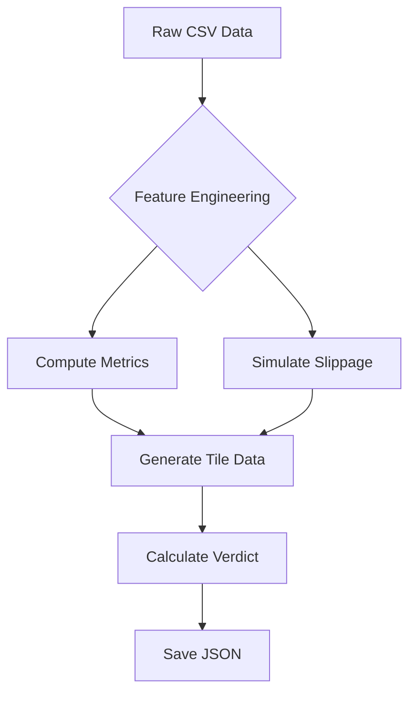
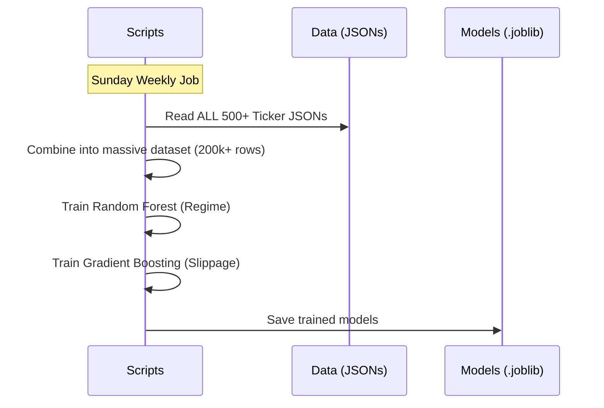
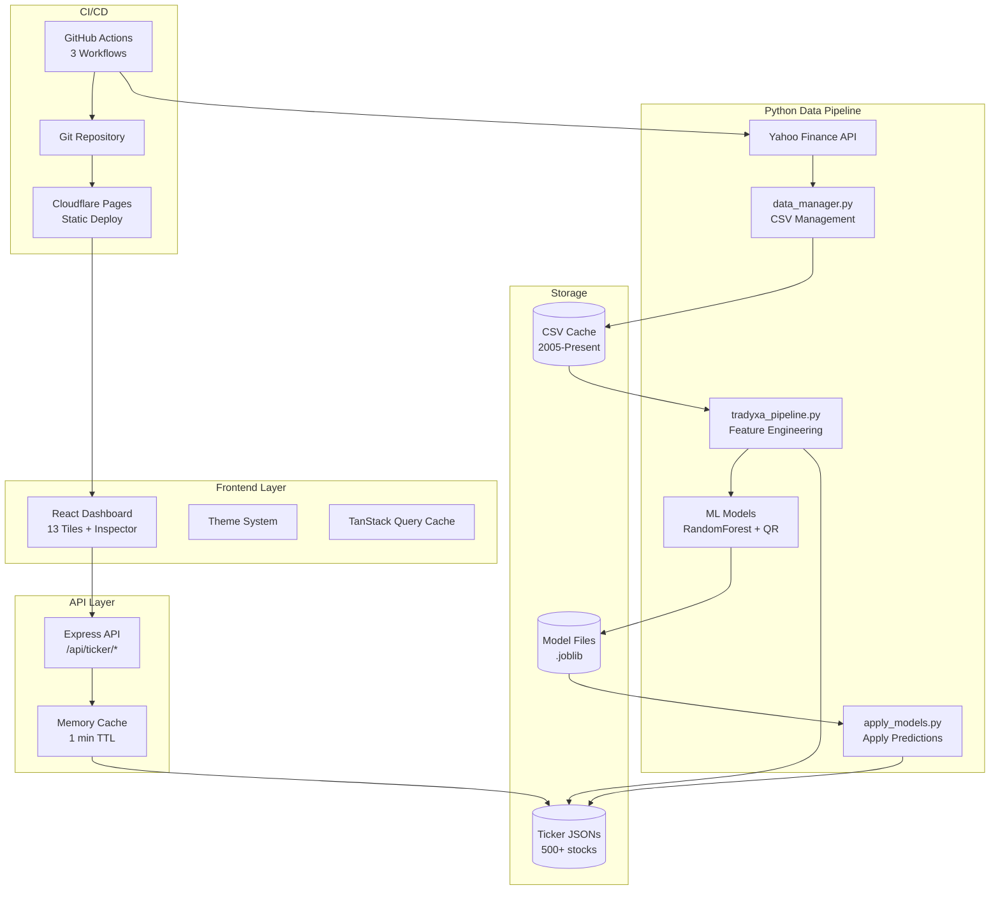

# Tradyxa Aztryx - Trading Intelligence Dashboard

A production-grade financial analytics dashboard for Indian stock traders featuring **12 analytical tiles + 1 verdict tile** with **real market microstructure data**, AI-powered insights, and investment guidance. Built with React/TypeScript frontend and Python/Node.js backend.

---

## 🆕 Recent Updates (v1.1.3 - Dec 2024)

### **Data Processing**
- ✅ **Automatic History Management**: Fetches data from **2005-01-01** by default.
- ✅ **Smart Incremental Updates**: Only downloads new data (1 day) on subsequent runs.
- ✅ **Auto-Repair**: Automatically detects and fixes corrupted data (empty rows, duplicates).
- ✅ **Zero-Maintenance**: No manual CSV deletion needed.

### **Code Quality**
- ✅ Fixed all Python deprecation warnings (pandas, datetime)
- ✅ Improved JSON validation (no more NaN/Infinity in output)
- ✅ Added rate limiting protection for yfinance API

---

## 📘 The "A to Z" System Guide

This section explains exactly how the entire system works, from fetching raw data to displaying it on the dashboard.

### 1. Data Fetching (`data_manager.py`)

**Goal:** Get raw OHLCV (Open, High, Low, Close, Volume) data for 500+ stocks.

**How it works:**
1.  **Source:** Uses `yfinance` API to download data from Yahoo Finance.
2.  **Smart Logic:**
    *   **First Run:** Downloads full history from **2005-01-01** to present.
    *   **Next Runs:** Checks the last date in your CSV. Calculates `Start Date = Last Date + 1 Day`. Downloads **only** the missing days.
    *   **Backfilling:** If your CSV starts in 2010, it automatically detects the gap (2005-2010) and fills it.
3.  **Cleaning:**
    *   Removes empty rows (market holidays).
    *   Removes duplicate columns (fixing "Reindexing" errors).
    *   Standardizes column names.
4.  **Storage:** Saves clean data to `public/data/raw/{TICKER}.csv`.

### 2. The Master Pipeline (`tradyxa_pipeline.py`)

**Goal:** Convert raw CSV data into actionable insights and JSON files for the dashboard.

**Process Flow:**



**Key Calculations:**
*   **Amihud Illiquidity:** Measures how much price moves per unit of volume. (High = Hard to trade).
*   **Lambda (Kyle's):** Measures price impact of a trade.
*   **Market Flow (MFC):** Detects if big money is buying or selling.
*   **Slippage Simulation:**
    *   **Deterministic:** Calculates expected cost based on volume profile.
    *   **Monte Carlo:** Runs 1000 simulations to predict "Worst Case" slippage.

### 3. Machine Learning Training (Weekly)

**Goal:** Teach the AI to predict market regimes and slippage.

**Models:**
1.  **Regime Classifier (Random Forest):**
    *   **Input:** Volatility, Amihud, Lambda, MFC, Time of Day.
    *   **Output:** Market Regime (LOW, NORMAL, HIGH, SEVERE).
    *   **Why:** To warn you when market conditions are dangerous.
2.  **Slippage Forecaster (Quantile Regression):**
    *   **Input:** Same features + Trade Size.
    *   **Output:** Predicted Slippage (Median & 90th Percentile).
    *   **Why:** To tell you "If you buy ₹10L now, you will lose 0.15% in slippage".

**Training Workflow:**



### 4. The Verdict Logic

**Goal:** Give a simple "UP" or "DOWN" signal with confidence.

**Formula:**
The verdict is a weighted score ($S$) of 4 components + AI adjustments:

$$ S = (w_M \times Momentum) + (w_F \times Flow) + (w_L \times Liquidity) + (w_C \times Cost) + AI_{Regime} + AI_{Slippage} $$

*   **Momentum:** Is price moving up?
*   **Flow:** Is volume buying or selling?
*   **Liquidity:** Is it easy to trade?
*   **Cost:** Is slippage low?

**Interpretation:**
*   $S > 0.05$: **UP** (Bullish)
*   $S < -0.05$: **DOWN** (Bearish)
*   $-0.05 < S < 0.05$: **NEUTRAL**

**Confidence Score:**
Calculated based on:
1.  **Strength:** How strong is the signal $S$?
2.  **Data Quality:** Do we have enough data points?
3.  **Consistency:** Do Momentum, Flow, and Liquidity agree?

### 5. From JSON to Dashboard

**Why JSON?**
*   **Speed:** JSON files are static. The dashboard reads them instantly without waiting for a database query.
*   **Cost:** Hosting static JSON files is free (GitHub/Cloudflare).

**Data Flow:**
1.  **Python** generates `TATASTEEL.json` in `public/data/ticker/`.
2.  **React Frontend** requests `/api/ticker/TATASTEEL`.
3.  **Node.js Backend** reads the JSON file and sends it to the frontend.
4.  **React Components** (Recharts) render the graphs using the data arrays (e.g., `volumeProfile`, `candles`).

### 6. GitHub Actions Workflows (Automated Pipeline)

**Goal:** Fully automated data updates with zero-cost hosting.

#### Workflow Architecture

```mermaid
flowchart TB
    subgraph Initial["🚀 INITIAL SETUP (Run Once Manually)"]
        I1[Fetch 503 CSVs from 2005] --> I2[Train ML Models]
        I2 --> I3[Generate JSONs]
        I3 --> I4[Git Push All]
    end
    
    subgraph Weekly["📅 WEEKLY (Sunday 2 AM IST)"]
        W1[Train Regime Classifier] --> W2[Train Slippage Models]
        W2 --> W3[Apply Predictions]
        W3 --> W4[Git Push]
    end
    
    subgraph Daily["📆 DAILY (Mon-Fri 3:45 PM IST)"]
        D1[Append Today's OHLCV to CSVs] --> D2[Generate Feature JSONs]
        D2 --> D3[Apply ML Predictions]
        D3 --> D4[Fetch Live Prices]
        D4 --> D5[Git Push All]
    end
    
    subgraph Live["⏰ LIVE (Every 2 Hours)"]
        L1[Fetch NIFTY, BANKNIFTY, VIX] --> L2[Update spot_prices.json]
        L2 --> L3[Git Push]
    end
    
    Initial --> Daily
    Daily --> Weekly
    Weekly --> Daily
    Daily --> CF[Cloudflare Pages Deploy]
    Live --> CF
```



#### Workflow Files

| File | Schedule | Purpose |
|------|----------|---------|
| `initial-setup.yml` | **Manual (once)** | Generate 503 CSVs from 2005 + train |
| `weekly-pipeline.yml` | Sunday 2:00 AM IST | Retrain ML models only |
| `daily_update.yml` | Mon-Fri 3:45 PM IST | Append OHLCV + predictions |
| `live_spot_prices.yml` | Every 2 hours (market) | Update live prices only |

#### The Logic Flow

1. **Initial Setup (Run Once):**
   - Fetches all 503 tickers from 2005 → Creates CSVs
   - Trains ML models → Saves `.joblib` files
   - This is your **one-time bootstrap**

2. **Daily Update (Mon-Fri):**
   - `data_manager.py` checks CSV → Only fetches NEW days
   - Appends today's OHLCV to existing CSV
   - Regenerates JSONs with fresh data

3. **Weekly Training (Sunday):**
   - Uses existing CSVs (already updated by daily)
   - Retrains models on latest data patterns
   - Applies fresh predictions

4. **Live Prices (Intraday):**
   - Lightweight: just fetches NIFTY, BANKNIFTY, VIX
   - Updates `spot_prices.json` for dashboard

#### Cost Estimate (Private Repo - FREE!)

| Workflow | Runs/Month | Time/Run | Total Mins |
|----------|------------|----------|------------|
| Initial Setup | 1 (once) | 50 min | **50 min** |
| Weekly Training | 4 | 15 min | **60 min** |
| Daily Update | 22 | 3 min | **66 min** |
| Live Spot (4x/day) | 88 | 1 min | **88 min** |
| **TOTAL** | 115 | - | **264 min** |

**GitHub Free Tier:** 2,000 mins/month → Using only **13%** ✅

**Cloudflare Pages:** 500 builds/month → Using ~30 builds → **6%** ✅

---

## 🎯 Key Features

### Dashboard Tiles (12 Analysis + 1 Verdict)
1. **Spot Price** - Current market price with change %
2. **India VIX** - Market volatility gauge
3. **Slippage Expectation** - Trading cost estimate
4. **Volume Profile** - Price level distribution with buy/sell
5. **Orderbook Depth** - Bid/ask depth visualization
6. **Candles with Bollinger Bands** - Price action with volatility bands
7. **Price with Rolling Averages** - MA5, MA20, MA50 trends
8. **Slippage vs Volume Scatter** - Cost vs liquidity analysis
9. **Timeline Events** - Corporate actions (splits, dividends, earnings)
10. **Activity Heatmap** - Intraday trading intensity (hour × day)
11. **Order Flow Absorption** - Buy/sell flow analysis
12. **Returns Distribution** - Histogram of daily returns
13. **Verdict Tile** - Aggregated AI signal (BULLISH/BEARISH/NEUTRAL) with confidence

### Smart Insights
✨ **Dynamic insights on every tile** that change based on real market data for each stock:
- Volume Profile: "📉 People sold LOWER prices - Market moved UP since then"
- Orderbook: "🟢 More buyers than sellers - Might go UP!"
- Bollinger Bands: "⬆ Price is higher - Might keep going up"
- Absorption Flow: "🔴 More people SELLING - Price might go DOWN"

**Note:** These insights are **NOT static** - they change for every stock based on that stock's actual data! Switch from NIFTY to TATASTEEL and see different insights.

### Investment Guidance
💰 **"Invest THIS MUCH" display** in left sidebar:
- Shows recommended position size based on market risk
- Example: "Use ₹9,85,241 (99%) - Our MODEL says rest stay SAFE"
- Multiplier derived from real market friction metrics

---

## 🚀 Run Instructions

### 1. Update Data (Batch Run)
This is the main command to update all 500+ stocks.
```powershell
python scripts/tradyxa_pipeline.py --mode batch_run --tickers-file scripts/nifty500.txt --max-workers 4 --use-yf
```

### 2. Train Models (Weekly)
Run this after updating data to let AI learn from new history.
```powershell
python scripts/train_regime_classifier.py
python scripts/train_slippage_quantile.py
```

### 3. Apply Models
Injects AI predictions into the dashboard data.
```powershell
python scripts/apply_models.py
```

### 4. Start Dashboard
```powershell
npm run dev
```

---

## 🏗️ System Architecture

### End-to-End Data Flow



## Legal

Market data © Yahoo Finance. Tradyxa Aztryx is unaffiliated with NSE or exchanges.
Data may be delayed. For educational use only.

© 2025 Zeta Aztra Technologies. All Rights Reserved.
