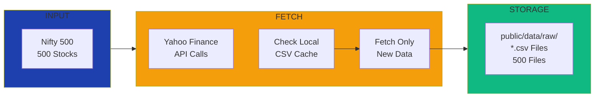
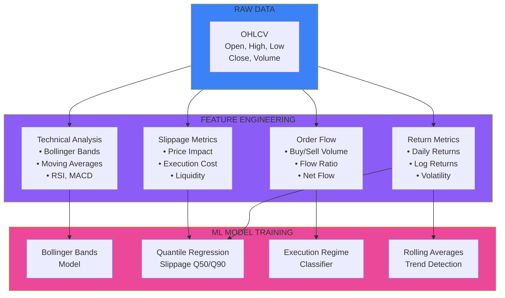
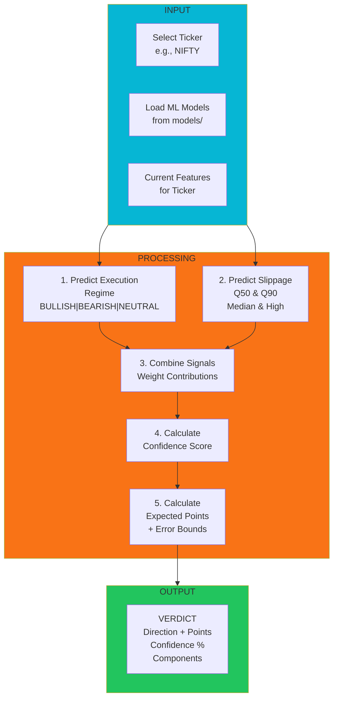
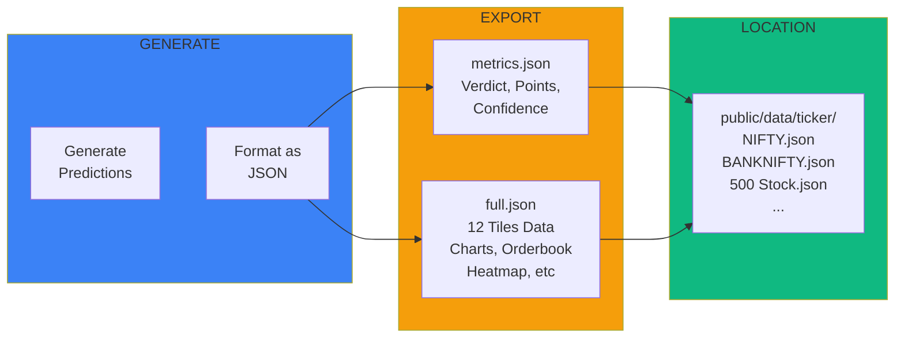
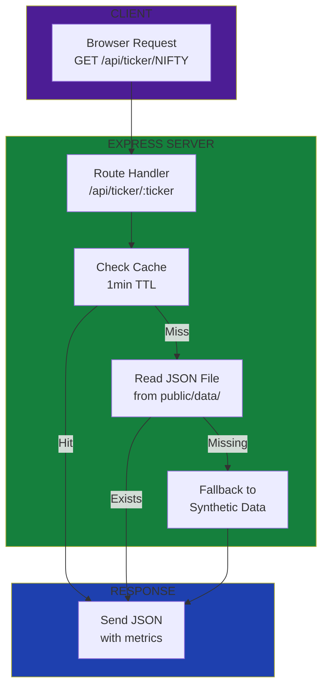
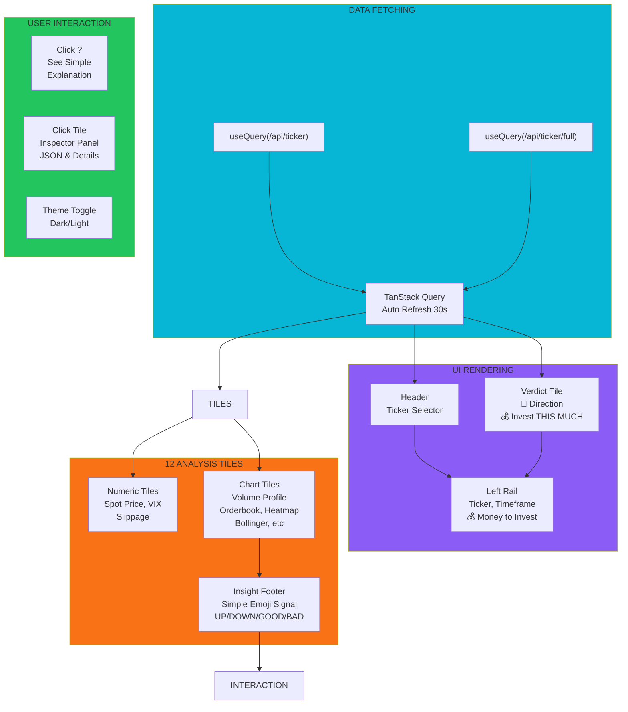
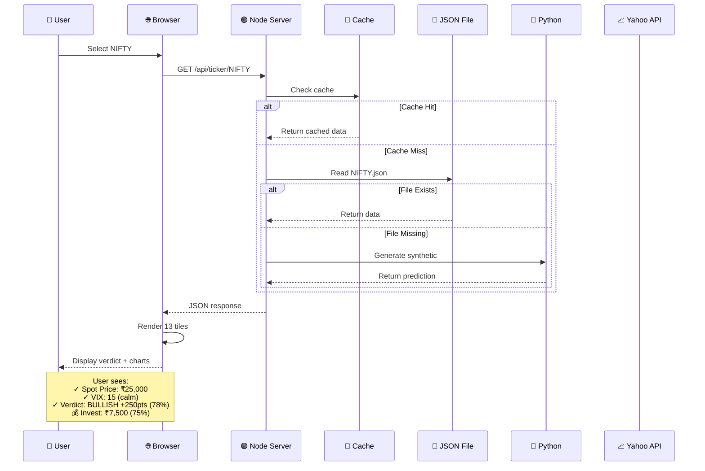

# 📊 Tradyxa Aztryx - Complete Architecture Guide

> AI-powered trading intelligence platform for Indian stock market analysis (Nifty 50, BankNifty, Nifty 500) with real-time ML predictions and execution guidance.

---

## 🏗️ System Architecture Overview

```mermaid
graph TB
    subgraph DataSources["📈 Data Sources"]
        YAHOO["Yahoo Finance API"]
        CSV["Local CSV Cache"]
        SYNTHETIC["Synthetic Generator"]
    end
    
    subgraph PythonBackend["🐍 Python Backend Pipeline"]
        FETCH["1. Fetch Raw Data<br/>from 500+ stocks"]
        CLEAN["2. Data Cleaning<br/>Normalize OHLCV"]
        FEATURES["3. Feature Engineering<br/>TA, Returns, Vol"]
        TRAIN["4. Train ML Models<br/>Bollinger, MA, Slippage"]
        PREDICT["5. Generate Predictions<br/>Verdict, Confidence"]
        EXPORT["6. Export JSON<br/>to public/data/"]
    end
    
    subgraph NodeBackend["🟢 Node.js Server"]
        EXPRESS["Express Server<br/>Port 5000"]
        CACHE["In-Memory Cache<br/>1min TTL"]
        ROUTES["API Routes<br/>/api/ticker/"]
    end
    
    subgraph Frontend["⚛️ React Dashboard"]
        DASHBOARD["Dashboard.tsx<br/>Main Layout"]
        TILES["12 Analysis Tiles<br/>+ Verdict"]
        MODALS["Modals<br/>Explain/Inspector"]
    end
    
    subgraph Browser["🌐 User Browser"]
        UI["Interactive UI<br/>Real-time Updates"]
    end
    
    DataSources --> PythonBackend
    PythonBackend --> EXPORT
    EXPORT --> NodeBackend
    NodeBackend --> Frontend
    Frontend --> Browser
    NodeBackend -.->|Fallback| SYNTHETIC
    
    style DataSources fill:#1e40af
    style PythonBackend fill:#7c2d12
    style NodeBackend fill:#15803d
    style Frontend fill:#4c1d95
    style Browser fill:#0c4a6e
```



---

## 📥 **Phase 1: Data Collection - From 500+ Stocks**

### 🔄 Data Fetching Pipeline



**How it works:**
1. **Load list** of 500 Nifty stocks from `scripts/nifty500.txt`
2. **Check cache** - if stock data exists in `public/data/raw/*.csv`, load it
3. **Incremental fetch** - only download data since last update (saves 90% bandwidth)
4. **Save to CSV** - store 5 years of OHLCV data locally

**Code location:** `scripts/data_manager.py` → `fetch_and_update_data()`

---

## 🧠 **Phase 2: Feature Engineering & Model Training**

### 📊 Feature Calculation Process



**Features Generated Per Stock:**
- **Technical**: Bollinger Bands (upper/lower/middle), 5/20/50-day MAs
- **Returns**: Daily, log returns, rolling volatility
- **Volume**: Buy volume, sell volume, total volume
- **Slippage**: Expected cost, liquidity measures

**Models Trained:**
1. `rf_execution_regime.joblib` - Random Forest for market regime (bullish/bearish/neutral)
2. `qr_slippage_q50.joblib` - Quantile Regression for median slippage
3. `qr_slippage_q90.joblib` - Quantile Regression for 90th percentile slippage

---

## 🔮 **Phase 3: Prediction & Verdict Generation**

### 🎯 Verdict Calculation Engine



**Verdict Contains:**
- **Direction**: BULLISH (+), BEARISH (-), NEUTRAL (→)
- **Points**: Expected price movement with ±error margin
- **Confidence**: 0-100% based on signal alignment
- **Components**: Which indicators voted UP/DOWN (waterfall view)
- **Multiplier**: Trade sizing (0.25 = invest 25% of capital)

---

## 🚀 **Phase 4: Data Export & API Serving**

### 📤 JSON Export Structure



**JSON Files Generated:**
```
public/data/ticker/
├── NIFTY.json (metrics: verdict, vix, slippage, trade_sizing_multiplier)
├── NIFTY_full.json (full: 12 tiles data - charts, heatmap, orderbook, etc)
├── BANKNIFTY.json
├── BANKNIFTY_full.json
├── RELIANCE.json
├── RELIANCE_full.json
└── ... (500 stocks total)
```

---

## 🟢 **Phase 5: Node.js Backend Server**

### 🔌 API Serving Pipeline



**API Endpoints:**
```
GET /api/ticker/:ticker
  Returns: { metrics, meta, data_quality }
  
GET /api/ticker/:ticker/full
  Returns: { 
    spotPrice, indiaVix, slippageExpectation,
    volumeProfile, orderbook, candles,
    rollingAverages, slippageByVolume, timelineEvents,
    activityHeatmap, orderFlowAbsorption, returnsHistogram,
    verdict
  }
```

---

## ⚛️ **Phase 6: React Frontend Display**

### 🎨 Dashboard Layout & Data Flow



**12 Analysis Tiles + 1 Verdict:**

| Tile | Type | Insight |
|------|------|---------|
| Spot Price | Numeric | Current market price |
| India VIX | Numeric | Market fear (high=scared) |
| Slippage | Numeric | Trading cost (✓ Good / ⚠ Bad) |
| Volume Profile | Chart | People buying/selling here |
| Orderbook Depth | Chart | Current buy/sell queue |
| Bollinger Bands | Chart | Price at extreme? |
| Rolling Avg | Chart | All trends aligned? |
| Scatter Plot | Chart | Volume vs Slippage |
| Heatmap | Chart | When is market busiest? |
| Absorption | Chart | Buyers or sellers winning? |
| Histogram | Chart | Trending or bouncing? |
| Timeline | Chart | Upcoming events |
| **VERDICT** | **Verdict** | **BUY/SELL/WAIT + $ Amount** |

---

## 🔄 **Complete Data Flow Example: NIFTY Stock**



---

## 📊 **Data Pipeline Command Sequence**

```bash
# Step 1: Fetch raw data from Yahoo Finance (500 stocks)
python3 scripts/fetch_tickers.py
# Output: public/data/raw/*.csv (500 files)

# Step 2: Train ML models on historical data
python3 scripts/train_slippage_quantile.py
python3 scripts/train_regime_classifier.py
# Output: models/*.joblib (ML model files)

# Step 3: Generate predictions for all tickers
python3 scripts/tradyxa_pipeline.py --all
# Output: public/data/ticker/*.json (1000 files - metrics + full)

# Step 4: Start Node server
npm run dev
# Starts on port 5000 → http://localhost:5000

# Step 5: User opens browser
# Browser requests /api/ticker/NIFTY
# Server returns cached/file/synthetic data
# Dashboard renders 13 tiles with insights
```

---

## 🎯 **Key Features in Action**

### 💰 Investment Guidance System

```
User Input:
  "I want to invest ₹1,000,000"
  
System Calculates:
  1. Run verdict on NIFTY
  2. Get trade_sizing_multiplier (e.g., 0.75 = 75%)
  3. Calculate: ₹1,000,000 × 0.75 = ₹750,000
  
Display:
  Left Sidebar: "💰 Invest THIS MUCH: ₹7,50,000 (75%)"
  Verdict Tile: Same amount shown
  All updates in real-time as user changes investment amount
```

### 🔍 Simple Explanations for Non-Technical Users

```
When user clicks "?" on Volume Profile tile:

Modal Shows:
  ✓ Technical Description
  ✓ SIMPLE EXPLANATION:
    "Imagine a restaurant - some prices have 
     MORE customers (high volume).
     • More people want to SELL = Price might go DOWN
     • More people want to BUY = Price might go UP"
  ✓ Green/Amber/Red Thresholds
  ✓ Example Actions to take
```

### 📊 Chart Insights

```
Every chart tile footer shows:
  
  Volume Profile:
  "📉 People sold LOWER prices before - Market moved UP since then"
  
  Orderbook:
  "🟢 More buyers than sellers - Might go UP!"
  
  Bollinger Bands:
  "⬆⬆ Price is HIGH - May come down soon"
  
  Uses: Emoji + direction + simple outcome
  Target: Non-technical traders understand instantly
```

---

## 🏢 **Production Deployment**

### Cloudflare Pages Deployment
```bash
# Automatic deployment via GitHub Actions
# Push to main branch triggers Cloudflare Pages build
git push origin main
# Dashboard available at: https://tradyxa-betax.pages.dev
```

### Self-Hosted (Linux/Mac/Windows)
```bash
# 1. Install dependencies
npm install
pip install -r requirements.txt

# 2. Generate data (optional)
python scripts/tradyxa_pipeline.py --mode batch_run --tickers-file scripts/nifty500.txt

# 3. Start server
npm run dev
```

---

## 📈 **Data Quality Badges**

Each tile shows data quality:
- **GOOD** ✅ - Real data from trained models
- **LOW** ⚠️ - Limited data, increased uncertainty
- **INSUFFICIENT** ❌ - Not enough data yet

---

## 🔒 **Security & Privacy**

- **No backend database** - All data in-memory + JSON files
- **No personal data** - Only financial market data
- **Cookie consent** - Optional analytics toggle
- **Disclaimer** - 48-hour cache, educational use only

---

## 📚 **File Structure**

```
Tradyxa Aztryx/
├── client/                     # React Frontend
│   ├── public/
│   │   ├── data/
│   │   │   ├── raw/           # *.csv from Yahoo Finance
│   │   │   └── ticker/        # *.json generated predictions
│   │   ├── favicon.svg        # Cyan theme icon
│   │   └── og-image.svg       # Social media image
│   ├── src/
│   │   ├── pages/Dashboard.tsx
│   │   ├── components/        # 12 tiles + verdict
│   │   └── lib/chartInsights.ts  # Simple explanations
│   └── index.html
│
├── server/                     # Node.js Express
│   ├── index.ts              # Express app
│   ├── routes.ts             # API endpoints
│   ├── storage.ts            # JSON file loading
│   └── syntheticData.ts      # Fallback data
│
├── scripts/                    # Python Pipeline
│   ├── data_manager.py       # Yahoo Finance fetching
│   ├── tradyxa_pipeline.py   # Main prediction engine
│   ├── train_*.py            # ML model training
│   ├── nifty500.txt          # 500 stock list
│   └── fetch_tickers.py      # Download all data
│
├── models/                     # ML Models (*.joblib)
├── shared/schema.ts          # TypeScript types
├── SIMPLE_EXPLANATIONS.md    # User guide
└── README.md                 # This file
```

---

## 🚀 **Quick Start**

```bash
# Clone repository
git clone https://github.com/pravindev666/Gammax.git
cd "Tradyxa Aztryx"

# Install
npm install

# Run (port 5000)
npm run dev

# Open browser
open http://localhost:5000
```

---

## 📞 **Support**

For issues or questions:
1. Check `SIMPLE_EXPLANATIONS.md` for tile descriptions
2. Click "?" on any tile for help modal
3. Review this architecture guide
4. Check `ARCHITECTURE_DECISION.md` for design choices

---

**Version:** 1.0.0  
**Last Updated:** December 2, 2025  
**Theme:** Cyan-blue on dark/light background  
**Target Users:** Non-technical stock traders, educational use only
