# Security Audit Report - Tradyxa Aztryx

**Audit Date:** December 6, 2024  
**Auditor:** Automated Security Scan + Manual Review  
**Overall Risk Level:** 🟡 MEDIUM

---

## Executive Summary

Tradyxa Aztryx is a **low-risk static dashboard** with minimal attack surface. The application primarily serves pre-generated JSON files with no user authentication, no database, and no user-submitted data. However, there are several areas for improvement.


---

## 1. Vulnerability Overview

```mermaid
graph TB
    subgraph Critical["🔴 CRITICAL (0)"]
    end
    
    subgraph High["🟠 HIGH (1)"]
        H1["glob CLI Command Injection"]
    end
    
    subgraph Medium["🟡 MEDIUM (5)"]
        M1["esbuild Dev Server Vulnerability"]
        M2["brace-expansion ReDoS"]
        M3["No Rate Limiting"]
        M4["No CORS Configuration"]
        M5["Path Traversal Risk"]
    end
    
    subgraph Low["🟢 LOW (3)"]
        L1["on-headers HTTP Header Manipulation"]
        L2["express-session Dependency Issue"]
        L3["No CSP Headers"]
    end
    
    style Critical fill:#dc2626
    style High fill:#f97316
    style Medium fill:#eab308
    style Low fill:#22c55e
```



---

## 2. NPM Dependency Vulnerabilities

**Command:** `npm audit`  
**Result:** 9 vulnerabilities found

| Package | Severity | Issue | Fix |
|---------|----------|-------|-----|
| `glob` | 🔴 HIGH | Command injection via `-c/--cmd` | `npm audit fix` |
| `esbuild` | 🟠 MODERATE | Dev server request vulnerability | Update vite |
| `brace-expansion` | 🟠 MODERATE | ReDoS vulnerability | `npm audit fix` |
| `on-headers` | 🟢 LOW | HTTP header manipulation | `npm audit fix` |
| `express-session` | 🟢 LOW | Depends on vulnerable on-headers | `npm audit fix` |

### Recommended Action
```bash
# Fix non-breaking vulnerabilities
npm audit fix

# Check remaining issues
npm audit
```

---

## 3. API Security Analysis

### Current State

```mermaid
sequenceDiagram
    participant Attacker as 🔴 Attacker
    participant Server as 🖥️ Express Server
    participant Files as 📁 JSON Files
    
    Attacker->>Server: GET /api/ticker/../../etc/passwd
    Server->>Server: cleanTicker = "../../ETC/PASSWD"
    Server->>Files: Read public/data/ticker/../../ETC/PASSWD.json
    Note over Files: Path traversal attempt
    Files-->>Server: File not found (safe due to .json suffix)
    Server-->>Attacker: 404 or synthetic data
```



### 3.1 Path Traversal Risk 🟡

**Location:** `server/routes.ts` line 54-57

```typescript
// CURRENT (Potentially Unsafe)
const cleanTicker = ticker.toUpperCase();
const filePath = `public/data/ticker/${cleanTicker}.json`;
```

**Risk:** An attacker could try `GET /api/ticker/../../sensitive-file` but the `.json` suffix and uppercase conversion provide some protection.

**Recommended Fix:**
```typescript
// SAFER VERSION
const cleanTicker = ticker.toUpperCase().replace(/[^A-Z0-9]/g, '');
if (cleanTicker.length === 0 || cleanTicker.length > 20) {
  return res.status(400).json({ error: "Invalid ticker" });
}
const filePath = `public/data/ticker/${cleanTicker}.json`;
```

---

### 3.2 No Rate Limiting 🟡

**Risk:** API endpoints have no rate limiting, allowing:
- DoS attacks via repeated requests
- Brute-force ticker enumeration

**Recommended Fix:**
```typescript
import rateLimit from 'express-rate-limit';

const limiter = rateLimit({
  windowMs: 15 * 60 * 1000, // 15 minutes
  max: 100, // limit each IP to 100 requests per window
  message: { error: 'Too many requests, try again later' }
});

app.use('/api/', limiter);
```

---

### 3.3 No CORS Configuration 🟡

**Current State:** No CORS middleware detected.

**Risk:** API may be accessible from any origin (browser default allows same-origin only, but explicit policy is better).

**Recommended Fix:**
```typescript
import cors from 'cors';

app.use(cors({
  origin: ['https://tradyxa-betax.pages.dev'],
  methods: ['GET', 'POST'],
}));
```

---

## 4. Frontend Security Analysis

### 4.1 dangerouslySetInnerHTML Usage ✅ SAFE

**Location:** `client/src/components/ui/chart.tsx` line 81

```typescript
dangerouslySetInnerHTML={{
  __html: Object.entries(THEMES)
    .map(([theme, prefix]) => `...CSS styles...`)
    .join("\n"),
}}
```

**Assessment:** ✅ SAFE - This only generates CSS styles from internal config, not user input.

---

### 4.2 No Content Security Policy 🟢

**Risk:** No CSP headers means scripts could theoretically be injected if XSS exists.

**Recommended Fix (in index.html):**
```html
<meta http-equiv="Content-Security-Policy" 
      content="default-src 'self'; 
               script-src 'self' 'unsafe-inline'; 
               style-src 'self' 'unsafe-inline' https://fonts.googleapis.com; 
               font-src 'self' https://fonts.gstatic.com;
               img-src 'self' data: https:;">
```

---

## 5. Data Security


### 5.1 Sensitive Data Scan ✅

| Check | Result |
|-------|--------|
| Hardcoded passwords | ✅ None found |
| API keys in code | ✅ None found |
| Secrets in .env | ✅ .env is gitignored |
| PII storage | ✅ No user data collected |

---

## 6. Infrastructure Security

### 6.1 Cloudflare Pages ✅

- ✅ Automatic HTTPS
- ✅ DDoS protection
- ✅ Edge caching
- ✅ No origin server exposed

### 6.2 GitHub Actions

**Current Risk:** Workflow writes to repository.

**Recommendation:** Already addressed by enabling "Read and write permissions" in repo settings.

---

## 7. Security Score Card


---

## 8. Action Items

### 🔴 Priority 1 (Do Now)
- [ ] Run `npm audit fix` to patch 4 vulnerabilities
- [ ] Add input sanitization to ticker parameter

### 🟠 Priority 2 (This Week)
- [ ] Add rate limiting middleware
- [ ] Configure CORS for production domain

### 🟢 Priority 3 (Nice to Have)
- [ ] Add CSP headers
- [ ] Add security headers (X-Frame-Options, X-Content-Type-Options)
- [ ] Consider adding request logging for security monitoring

---

## 9. Quick Fix Commands

```bash
# Fix npm vulnerabilities (safe fixes only)
npm audit fix

# Add security packages
npm install express-rate-limit cors helmet

# View remaining issues
npm audit
```

---

## 10. Conclusion

Tradyxa Aztryx has a **low attack surface** due to its architecture:
- No user authentication
- No database
- No user-submitted data
- Static JSON serving

The main risks are dependency vulnerabilities and lack of API hardening. Following the recommendations above will improve the security posture significantly.

---

*Report generated: December 6, 2024*  
*Next audit recommended: March 2025*
