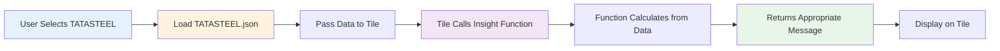

# Understanding Insights vs ML Predictions

## Quick Answer

### ❌ Small One-Line Insights DO NOT Use ML

Those colorful one-liner messages you see on each tile (like "✓ Easy to buy/sell - Good!" or "📈 People bought LOWER prices") are **NOT from ML models**. They're simple calculations from the data itself.

### ✅ BUT They ARE Dynamic - Change for Every Stock!

**Important:** While these insights don't use ML, they are **NOT static**. They change based on each stock's actual data!

**When you switch from NIFTY to TATASTEEL:**
- ✅ **Insights WILL change** based on TATASTEEL's data
- ✅ Each stock gets its own unique insights
- ✅ Same calculation logic, different results

**Think of it like a thermometer:**
- 🌡️ NIFTY's temperature = 25°C → Shows "Comfortable"
- 🌡️ TATASTEEL's temperature = 35°C → Shows "Hot"
- Same thermometer (same code), different readings (based on actual data)!

### Real Example:

| Stock | Slippage Median | Insight Shown |
|-------|----------------|---------------|
| **NIFTY** | 0.012 (1.2%) | ✓ Easy to buy/sell - Good! |
| **RELIANCE** | 0.035 (3.5%) | ✓ Pretty easy - OK! |
| **TATASTEEL** | 0.085 (8.5%) | ⚠ A bit hard to buy/sell |
| **Small Cap** | 0.15 (15%) | ⚠ Very hard to buy/sell - Be careful! |

**Same code, different messages because the data is different!**

---

**Examples:**
- ✓ Easy to buy/sell - Good! ← Calculated from slippage percentage
- 📈 People bought LOWER prices - Price climbed UP from there ← Calculated from volume distribution
- 🟡 Equal buyers & sellers - No clear direction ← Calculated from orderbook ratio
- ⬆ Price is higher - Might keep going up ← Calculated from Bollinger Band position
- 🟢 GOOD - Everything shows price going UP ← Calculated from MA5 > MA20 > MA50
- ⚠ Normal - Medium cost ← Calculated from average slippage
- 🔥 Most active: Friday at 14:00 - Busiest time! ← Calculated from heatmap data
- 🔴 More people SELLING - Price might go DOWN ← Calculated from buy/sell flow ratio
- ➡ Price moving SIDEWAYS - No clear direction ← Calculated from return distribution

**Where They Come From:**
- File: `client/src/lib/chartInsights.ts`
- Method: Simple if/else logic based on thresholds
- Example:
  ```typescript
  if (median < 0.02) return "✓ Easy to buy/sell - Good!";
  if (median < 0.05) return "✓ Pretty easy - OK!";
  if (median < 0.10) return "⚠ A bit hard to buy/sell";
  return "⚠ Very hard to buy/sell - Be careful!";
  ```

---

## ✅ Only 2 Tiles Use ML Models

### Tile 3: Slippage Expectation
**What ML Adds:**
- `predicted_median` - What ML thinks median slippage will be
- `predicted_p90` - What ML thinks worst-case slippage will be

**ML Models Used:**
- Q50 Slippage Model (GradientBoosting)
- Q90 Slippage Model (GradientBoosting)

**Without ML:** Shows basic slippage from simulation  
**With ML:** Shows more accurate predictions based on market patterns

---

### Tile 13: Verdict (The Big One at Bottom)
**What ML Adds:**
- `ml_regime_label` - Market condition (LOW/NORMAL/HIGH/SEVERE)
- `ml_regime_prob` - How confident the model is
- `ml_regime_contribution` - How regime affects the verdict score
- `ml_slippage_contribution` - How predicted slippage affects score

**ML Models Used:**
- Regime Classifier (RandomForest)
- Q50 + Q90 Slippage Models (GradientBoosting)

**Without ML:** Basic verdict from momentum + flow + liquidity  
**With ML:** Enhanced verdict that considers learned market patterns

---

## All Other Tiles (1, 2, 4-12): NO ML

These tiles work with **pure calculations** from CSV/JSON data:

| Tile | Data Source | Calculation Type | ML Used? |
|------|-------------|------------------|----------|
| 1. Spot Price | Live price API | Direct value | ❌ NO |
| 2. India VIX | Live VIX API | Direct value | ❌ NO |
| 4. Volume Profile | 60-day OHLCV | Distribution buckets | ❌ NO |
| 5. Orderbook Depth | Price + volatility | Synthetic orderbook | ❌ NO |
| 6. Bollinger Bands | 20-period close | SMA ± 2σ | ❌ NO |
| 7. Rolling Averages | Close prices | MA5, MA20, MA50 | ❌ NO |
| 8. Slippage vs Volume | Volume + price | Simulation samples | ❌ NO |
| 9. Timeline Events | Corporate actions | Event list | ❌ NO |
| 10. Activity Heatmap | Intraday patterns | Hour × day grid | ❌ NO |
| 11. Order Flow Absorption | OHLCV + volume | Buy/sell flow split | ❌ NO |
| 12. Returns Distribution | Daily returns | Histogram binning | ❌ NO |

---

## The Big Verdict Explained (For "Dumb Traders")

### What You See:
> "Aggregated momentum + flow produce a moderate down bias. Recommended: slice into 3 TWAPs."

### What It ACTUALLY Means (Simple English):

#### Part 1: "Aggregated momentum + flow"
**Translation:** "We looked at how the price is moving AND how much buying/selling is happening"

**In Simple Terms:**
- **Momentum** = Is the price going up or down lately?
- **Flow** = Are more people buying or selling?
- **Aggregated** = We combined these signals together

#### Part 2: "produce a moderate down bias"
**Translation:** "The combined signals point slightly toward price going DOWN"

**In Simple Terms:**
- **Down bias** = Price might fall
- **Moderate** = Not super strong, just a gentle signal
- Think of it like: "More clouds than sun, might rain a little"

#### Part 3: "Recommended: slice into 3 TWAPs"
**Translation:** "Don't buy/sell all at once, split your trade into 3 smaller pieces over time"

**In Simple Terms:**
- **TWAP** = Time-Weighted Average Price (fancy term for "spread out your trades")
- **Slice into 3** = Break your ₹10 lakh order into three ₹3.33 lakh orders
- **Why?** Because market conditions aren't super clear, so don't bet everything at once

---

## Verdict Examples in Simple Language

### Example 1: Strong UP Signal
**Technical:** "Aggregated momentum + flow produce a strong up bias. ML regime: NORMAL. Predicted slippage: 0.08%. Recommended: execute full size with 2 TWAPs."

**Simple Translation:**
> "Everything looks GOOD for price to go UP. Market is normal (not crazy). Trading won't be too expensive. You can buy/sell most of your money, just split it into 2 parts to be safe."

---

### Example 2: Weak DOWN Signal
**Technical:** "Aggregated momentum + flow produce a mild down bias. ML regime: HIGH. Predicted slippage: 0.15%. Recommended: reduce size and wait for better conditions."

**Simple Translation:**
> "Signals say price might go DOWN a little bit. Market is a bit crazy right now. Trading will be expensive. DON'T buy/sell yet - wait for a better time."

---

### Example 3: NEUTRAL Signal
**Technical:** "Aggregated momentum + flow produce a neutral signal. ML regime: NORMAL. Confidence low. Recommended: slice into 3 TWAPs."

**Simple Translation:**
> "We can't tell if price will go UP or DOWN. Market is normal but we're not confident. If you MUST trade, split your money into 3 small parts to minimize risk."

---

## Verdict Components Breakdown

### What Goes Into the Verdict Score?

#### 1. Momentum (45% weight)
**Simple:** Is the price trending up or down?
- UP = Good signal to buy
- DOWN = Good signal to sell
- FLAT = No clear direction

#### 2. Flow (25% weight)
**Simple:** Are more people buying or selling?
- More buyers = Price might go up
- More sellers = Price might go down
- Equal = No clear direction

#### 3. Liquidity (15% weight)
**Simple:** How easy is it to trade this stock?
- High liquidity = Easy to trade, good!
- Low liquidity = Hard to trade, risky!

#### 4. Impact Cost (15% weight)
**Simple:** How much will trading cost you?
- Low cost = Good, you won't lose money on fees
- High cost = Bad, trading is expensive

#### 5. ML Regime Contribution (10% weight) ⭐ FROM ML MODEL
**Simple:** What does the AI think about market conditions?
- LOW regime = Easy times, trading is cheap
- NORMAL regime = Normal times, okay to trade
- HIGH regime = Volatile times, be careful
- SEVERE regime = Crazy times, DON'T trade!

#### 6. ML Slippage Contribution (5% weight) ⭐ FROM ML MODEL
**Simple:** What does the AI think trading will cost?
- Low predicted slippage = Cheap to trade
- High predicted slippage = Expensive to trade

---

## How to Read the Verdict

### Confidence Level:
- **High (>70%)**: Trust the signal, follow the recommendation
- **Medium (40-70%)**: Signal is okay, but be cautious
- **Low (<40%)**: Signal is weak, maybe wait or use smaller size

### Direction:
- **UP**: Price might go up → Consider buying
- **DOWN**: Price might go down → Consider selling or waiting
- **NEUTRAL**: No clear direction → Be very careful, maybe skip

### Points:
- **Small (<5 points)**: Weak move expected
- **Medium (5-20 points)**: Moderate move expected
- **Large (>20 points)**: Strong move expected

### Recommendations Translation:

| Technical Recommendation | Simple Translation |
|--------------------------|-------------------|
| "Execute full size with 2 TWAPs" | Split your trade into 2 parts - conditions are good |
| "Slice into 3 TWAPs" | Split your trade into 3 parts - be cautious |
| "Reduce size and wait" | Trade LESS money and maybe wait for better time |
| "Wait for better conditions" | DON'T trade now - market is too risky |

---

## Summary

**Small Insights (One-Liners):**
- ❌ NO ML models used
- ✅ Simple calculations from data
- 💡 Quick visual feedback for each tile

**Big Verdict (Bottom Tile):**
- ✅ Uses ML models for regime + slippage
- ✅ Combines 6 different factors
- 💡 Gives you trading recommendation in plain language

**Only 2 Tiles Use ML:**
- Tile 3 (Slippage) - Enhanced predictions
- Tile 13 (Verdict) - Enhanced trading guidance

**All Other Tiles:**
- Pure math from CSV data
- No AI/ML involved
- Still accurate and useful!

---

## How Dynamic Insights Work (Technical Details)

### The Flow: From Data to Insight



### Code Example: Slippage Insight

**In the Tile Component** (`ScatterSlippage.tsx`):
```typescript
export function ScatterSlippage({ data, ... }) {
  // ... chart rendering ...
  
  return (
    <Card>
      {/* Chart */}
      <div className="border-t">
        <p className="text-xs text-muted-foreground">
          {getScatterInsight(data)}  {/* ← Passes THIS stock's data */}
        </p>
      </div>
    </Card>
  );
}
```

**In the Insight Calculator** (`chartInsights.ts`):
```typescript
export function getScatterInsight(data: SlippageSample[]): string {
  if (!data || data.length === 0) return "No data";
  
  // Calculate average slippage from THIS stock's data
  const avgSlippage = data.reduce((sum, d) => sum + Math.abs(d.slippage), 0) / data.length;
  
  // Return message based on THIS stock's slippage
  if (avgSlippage < 0.03) return `✓ Easy to trade - Low cost`;
  if (avgSlippage < 0.07) return `⚠ Normal - Medium cost`;
  return `❌ Hard to trade - High cost`;
}
```

### Real Stock Examples

#### Example 1: NIFTY (Liquid Index)
**Data:**
- Average daily volume: 50 million shares
- Slippage median: 0.012 (1.2%)
- Bid/Ask ratio: 1.4 (more buyers)
- MA5: 24,850, MA20: 24,700, MA50: 24,500

**Insights Shown:**
- Slippage: **"✓ Easy to buy/sell - Good!"**
- Orderbook: **"🟢 More buyers than sellers - Might go UP!"**
- Rolling Avg: **"🟢 GOOD - Everything shows price going UP"**

---

#### Example 2: TATASTEEL (Mid Liquidity)
**Data:**
- Average daily volume: 5 million shares
- Slippage median: 0.065 (6.5%)
- Bid/Ask ratio: 0.95 (balanced)
- MA5: 145, MA20: 148, MA50: 142

**Insights Shown:**
- Slippage: **"⚠ Normal - Medium cost"**
- Orderbook: **"🟡 Equal buyers & sellers - No clear direction"**
- Rolling Avg: **"🟡 MIXED - Signs are confused"**

---

#### Example 3: Small Cap Stock (Low Liquidity)
**Data:**
- Average daily volume: 200k shares
- Slippage median: 0.15 (15%)
- Bid/Ask ratio: 0.6 (more sellers)
- MA5: 52, MA20: 58, MA50: 65

**Insights Shown:**
- Slippage: **"❌ Hard to trade - High cost"**
- Orderbook: **"🔴 More sellers than buyers - Might go DOWN!"**
- Rolling Avg: **"🔴 BAD - Everything shows price going DOWN"**

---

### All Insight Functions and Their Logic

| Insight Function | Input Data | Calculation | Possible Outputs |
|-----------------|------------|-------------|------------------|
| `getSlippageInsight()` | Slippage median | Threshold check | "✓ Easy" / "⚠ Normal" / "❌ Hard" |
| `getVolumeProfileInsight()` | Volume buckets | Compare above/below peak | "📈 Bought LOWER" / "📉 Sold LOWER" / "➡ Divided" |
| `getOrderbookInsight()` | Bid/Ask quantities | Bid/Ask ratio | "🟢 More buyers" / "🔴 More sellers" / "🟡 Equal" |
| `getBollingerInsight()` | Bollinger bands | Price position in band | "⬆⬆ HIGH" / "⬇⬇ LOW" / "⬆ Higher" / "⬇ Lower" |
| `getRollingAverageInsight()` | MA5, MA20, MA50 | Compare MAs | "🟢 GOOD" / "🔴 BAD" / "🟡 MIXED" |
| `getScatterInsight()` | Slippage samples | Average slippage | "✓ Easy" / "⚠ Normal" / "❌ Hard" |
| `getHeatmapInsight()` | Hour×day grid | Find peak cell | "🔥 Most active: [Day] at [Hour]" |
| `getAbsorptionInsight()` | Buy/Sell flows | Net flow | "🟢 More BUYING" / "🔴 More SELLING" |
| `getHistogramInsight()` | Return bins | Find max bin | "⬆ UP more often" / "⬇ DOWN more often" / "➡ SIDEWAYS" |

---

### Why This Design is Smart

**Advantages:**
1. **No ML needed** - Simple thresholds are fast and interpretable
2. **Real-time updates** - Instantly reflects current market data
3. **Stock-specific** - Each stock gets relevant insights
4. **Easy to understand** - Traders see simple, actionable messages
5. **Maintainable** - Easy to adjust thresholds if needed

**Example of Threshold Tuning:**
```typescript
// If you want to make slippage insights stricter:
if (median < 0.01) return "✓ Easy";     // Changed from 0.02
if (median < 0.03) return "⚠ Normal";   // Changed from 0.05
if (median < 0.08) return "❌ Hard";    // Changed from 0.10
```

---

## Summary: Static vs Dynamic vs ML

| Feature | Static | Dynamic | ML-Enhanced |
|---------|--------|---------|-------------|
| **Changes per stock** | ❌ No | ✅ Yes | ✅ Yes |
| **Uses ML models** | ❌ No | ❌ No | ✅ Yes |
| **Calculation speed** | Instant | Instant | ~100ms per stock |
| **Interpretable** | ✅ Yes | ✅ Yes | ⚠️ Somewhat |
| **Example** | N/A (we don't use) | Small insights | Verdict + Slippage |
| **Code location** | N/A | `chartInsights.ts` | `apply_models.py` |

**The Perfect Combination:**
- **11 tiles** use dynamic insights (fast, interpretable, stock-specific)
- **2 tiles** use ML predictions (accurate, learns patterns, enhanced)
- **0 tiles** use static messages (we don't do this!)

