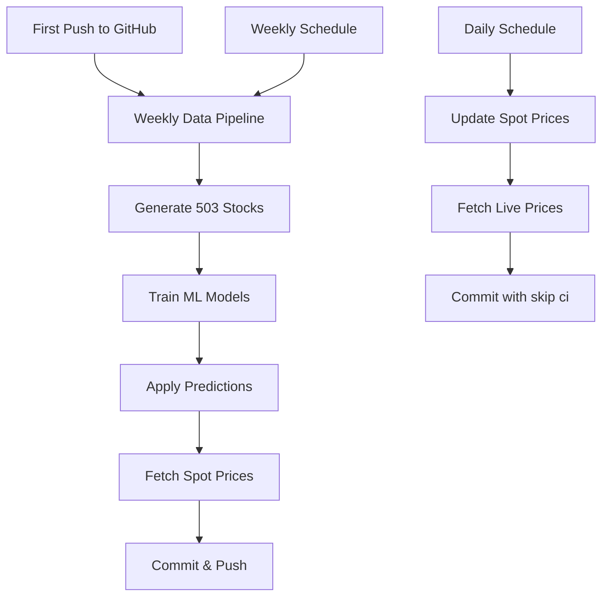

# 🔄 GitHub Actions Workflow Execution Order

**Repository:** pravindev666/Gammax  
**Last Updated:** 2025-12-05

---

## 🎯 First-Time Setup (Run Once)

After pushing code to GitHub for the first time, run workflows in this order:

### **Step 1: Weekly Data Pipeline & Cleanup** ⚙️
**Trigger:** Manual (workflow_dispatch)  
**Purpose:** Generate all 503 stocks data + train ML models  
**Time:** ~38 minutes  

**To run:**
1. Go to: `Actions` → `Weekly Data Pipeline & Cleanup`
2. Click `Run workflow` → `Run workflow`

**What it does:**
- ✅ Deletes old workflow runs (cleanup)
- ✅ Clears cache
- ✅ Fetches tickers list
- ✅ Generates data for all 503 stocks
- ✅ Trains regime classifier model
- ✅ Trains slippage forecasting models
- ✅ Applies ML predictions
- ✅ Fetches live spot prices
- ✅ Commits to repo

---

### **Step 2: Update Spot Prices** 💰
**Trigger:** Manual (workflow_dispatch)  
**Purpose:** Verify spot price fetching works  
**Time:** ~1.5 minutes  

**To run:**
1. Go to: `Actions` → `Update Spot Prices`
2. Click `Run workflow` → `Run workflow`

**What it does:**
- ✅ Fetches current prices for all 503 stocks
- ✅ Updates `public/data/live/spot_prices.json`
- ✅ Commits with `[skip ci]` (no Cloudflare rebuild)

---

## 📅 Regular Automated Schedule

After first-time setup, workflows run automatically:

### **Daily: Update Spot Prices** ⏰
**Schedule:** Every 2 hours during market hours (Mon-Fri)  
**Cron:** `30 3,5,7,9,11 * * 1-5` (9AM-5PM IST)  
**Frequency:** 5 times/day × 22 days = 110 runs/month  

**When it runs:**
- 9:00 AM IST
- 11:00 AM IST
- 1:00 PM IST
- 3:00 PM IST
- 5:00 PM IST

**What it does:**
- Fetches live prices
- Updates spot_prices.json
- Skips Cloudflare rebuild

---

### **Weekly: Full Data Pipeline & Cleanup** 📊
**Schedule:** Every Sunday at 2:00 AM IST  
**Cron:** `30 20 * * 0` (Saturday 8:30 PM UTC)  
**Frequency:** 4 runs/month  

**What it does:**
- Full 503-stock data regeneration
- Retrains all ML models
- Cleans up cache and old runs

---

## 🔧 Manual Workflow Triggers

### **When to manually run workflows:**

| Workflow | When to Run Manually |
|----------|---------------------|
| **Weekly Data Pipeline** | After fixing data bugs, or need fresh data immediately |
| **Update Spot Prices** | Market hours, want latest prices NOW |
| **Train ML Models** | After improving model code |

---

## 📊 Workflow Dependency Chart



---

## ⚡ Quick Reference

### **First Time:**
```
1. Run: Weekly Data Pipeline & Cleanup (38 min)
2. Verify: Check Actions tab shows ✅ green
3. Confirm: See new JSONs in public/data/ticker/
4. Optional: Run Update Spot Prices (1.5 min)
```

### **After First Time:**
```
✅ Automated:
- Spot prices every 2h (Mon-Fri, market hours)
- Full pipeline every Sunday 2 AM IST

📝 Manual (if needed):
- Click Actions → Select workflow → Run workflow
```

---

## 🎯 Expected Results

### **After First Run (Weekly Pipeline):**
- ✅ `public/data/ticker/` has 503 JSON files
- ✅ `models/` has 3 .joblib files
- ✅ `public/data/live/spot_prices.json` exists
- ✅ GitHub commit shows "📊 Weekly data pipeline update"

### **After Spot Price Update:**
- ✅ `public/data/live/spot_prices.json` updated
- ✅ GitHub commit shows "🔄 Update spot prices"
- ✅ Cloudflare NOT rebuilt (uses [skip ci])

---

## 💰 Cost Tracking

| Workflow | Runs/Month | Time/Run | Total |
|----------|------------|----------|-------|
| Spot Prices | 110 | 1.5 min | 165 min |
| Weekly Pipeline | 4 | 38 min | 152 min |
| Manual Runs | 2-3 | varies | ~50 min |
| **TOTAL** | - | - | **~370 min** |

**Free Tier:** 2,000 min/month  
**Usage:** 18.5%  
**Remaining:** 1,630 min (81% free) ✅

---

## 🐛 Troubleshooting

### **Workflow fails:**
1. Check `Actions` tab for error message
2. Look at failed step
3. Common issues:
   - Missing dependencies → Check `requirements.txt`
   - Rate limit → yfinance limit hit (wait 1 hour)
   - No changes → Normal, workflow exits cleanly

### **Data not updating:**
1. Check if workflow actually ran (Actions tab)
2. Verify commit was pushed (commits history)
3. Check Cloudflare Pages deployment

### **Cloudflare not deploying:**
1. Ensure commit doesn't have `[skip ci]`
2. Check Cloudflare Pages dashboard
3. Verify build command: `npm run build`

---

## 📋 Checklist for First-Time Setup

- [ ] Push code to GitHub
- [ ] Go to GitHub → Settings → Actions → Enable workflows
- [ ] Run "Weekly Data Pipeline & Cleanup" manually
- [ ] Wait 38 minutes for completion
- [ ] Verify green checkmark in Actions tab
- [ ] Check repo has new data files committed
- [ ] Visit Cloudflare Pages to see if deployed
- [ ] Test dashboard shows stock data
- [ ] Done! Workflows now run automatically ✅

---

## 🚀 Next Steps After Setup

1. ✅ Workflows run automatically (no action needed)
2. 📊 Check Actions tab weekly to verify runs
3. 🌐 Visit dashboard to see updated data
4. 💰 Monitor GitHub Actions usage (should stay <20%)

---

**Setup Status:** After running Weekly Pipeline once, you're done!  
**Maintenance:** Zero - fully automated ✅  
**Cost:** $0/month (Free tier) 💸
