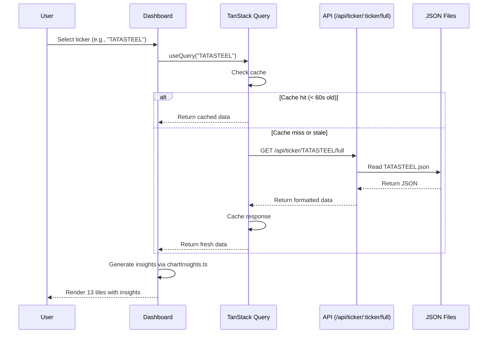

# Frontend (Client) Architecture

This document explains the React/TypeScript frontend architecture for the Tradyxa Aztryx dashboard.

## Frontend Architecture

```mermaid
graph TB
    subgraph "Entry Point"
        MAIN[main.tsx<br/>React 18 StrictMode]
    end
    
    subgraph "Application Shell"
        APP[App.tsx<br/>Router + Theme Provider]
        LAYOUT[MainLayout<br/>Header + Footer]
    end
    
    subgraph "Main Dashboard"
        DASH[Dashboard.tsx<br/>13 Tiles Layout]
        LEFT[LeftRail.tsx<br/>Ticker Selection<br/>Investment Guide]
        GRID[TileGrid<br/>Responsive 1/2/3 columns]
    end
    
    subgraph "Tiles (13 Total)"
        SPOT[SpotPriceTile]
        VIX[VixTile]
        SLIP[SlippageTile]
        VP[VolumeProfile]
        OB[Orderbook]
        CANDLES[CandlesWithBands]
        ROLL[RollingAverages]
        SCATTER[ScatterSlippage]
        TIME[Timeline]
        HEAT[Heatmap]
        FLOW[AbsorptionFlow]
        HIST[Histogram]
        VERD[VerdictTile<br/>AI Signal]
    end
    
    subgraph "Features"
        MODAL[ExplainModal<br/>Help System]
        INSP[InspectorPanel<br/>JSON Viewer]
        ERROR[ErrorBoundary]
        THEME[ThemeProvider<br/>Dark/Light]
    end
    
    subgraph "Data Layer"
        QUERY[TanStack Query<br/>Caching + Refetch]
        API[API Client<br/>fetch() wrapper]
        INSIGHTS[chartInsights.ts<br/>Dynamic Messages]
    end
    
    subgraph "Styling"
        TW[Tailwind CSS<br/>Utility-first]
        SHADE[shadcn/ui<br/>Radix Primitives]
        ANIM[Framer Motion<br/>Animations]
    end
    
    MAIN --> APP
    APP --> LAYOUT
    LAYOUT --> DASH
    DASH --> LEFT
    DASH --> GRID
    GRID --> SPOT
    GRID --> VIX
    GRID --> SLIP
    GRID --> VP
    GRID --> OB
    GRID --> CANDLES
    GRID --> ROLL
    GRID --> SCATTER
    GRID --> TIME
    GRID --> HEAT
    GRID --> FLOW
    GRID --> HIST
    DASH --> VERD
    DASH --> MODAL
    DASH --> INSP
    APP --> ERROR
    APP --> THEME
    
    SPOT --> QUERY
    VP --> QUERY
    CANDLES --> QUERY
    QUERY --> API
    QUERY --> INSIGHTS
    
    GRID --> TW
    SPOT --> SHADE
    MODAL --> ANIM
```

## Component Structure

### Core Components (`/src/components/`)

#### Dashboard Components
- **`Dashboard.tsx`** - Main dashboard layout with 13 tiles + inspector
- **`LeftRail.tsx`** - Ticker selector, investment recommendation, filters
- **`VerdictTile.tsx`** - AI verdict with confidence score and recommendation
- **`ExplainModal.tsx`** - Help modal system with "Simple Explanation" sections
- **`InspectorPanel.tsx`** - JSON data viewer for deep inspection
- **`ErrorBoundary.tsx`** - Catch React errors gracefully

#### Chart Components (`/components/charts/`)
| Component | Visualization | Data Source |
|-----------|---------------|-------------|
| `SpotPrice.tsx` | Current price + change % | `metrics.spot_price` |
| `VixDisplay.tsx` | India VIX gauge | `metrics.vix_latest` |
| `SlippageExpectation.tsx` | Trading cost estimate | `metrics.slippage_expectation` |
| `VolumeProfile.tsx` | Price level distribution | `volumeProfile[]` |
| `OrderbookDepth.tsx` | Bid/ask depth | `orderbook[]` |
| `CandlesWithBands.tsx` | OHLC + Bollinger Bands | `candles[]`, `bollingerBands[]` |
| `BarWithRolling.tsx` | Price + MA5/20/50 | `rollingAverages[]` |
| `ScatterSlippage.tsx` | Slippage vs volume | `slippageSamples[]` |
| `TimelineEvents.tsx` | Corporate actions | `events[]` |
| `HeatmapTile.tsx` | Intraday activity | `heatmap[]` |
| `StackedAreaAbsorption.tsx` | Buy/sell flow | `absorptionFlow[]` |
| `HistogramTile.tsx` | Returns distribution | `histogram[]` |

#### UI Components (`/components/ui/`)
All components from [shadcn/ui](https://ui.shadcn.com):
- `button`, `card`, `dialog`, `select`, `tabs`
- `accordion`, `alert`, `badge`, `tooltip`
- `scroll-area`, `separator`, `switch`
- Custom components built on Radix UI primitives

### Utilities (`/src/lib/`)

#### `chartInsights.ts` - Dynamic Insights Generator
Generates contextual messages based on market data:

```typescript
export function getVolumeProfileInsight(data: VolumeProfile[]): string
export function getOrderbookInsight(bidQty: number, askQty: number): string
export function getBollingerInsight(price: number, upper: number, lower: number): string
export function getAbsorptionInsight(buyFlow: number, sellFlow: number): string
// ... 10+ more insight generators
```

#### `utils.ts` - Helper Functions
- `cn()` - Tailwind class merging with `clsx` + `tw-merge`
- Number formatting, date formatting, etc.

#### `queryClient.ts` - TanStack Query Configuration
- Cache time: 60 seconds
- Stale time: 30 seconds
- Auto-refetch on window focus
- Retry failed requests 3 times

## Data Flow



## Responsive Design

### Breakpoints
- **Mobile** (< 768px): 1 column, left rail collapses to hamburger
- **Tablet** (768px - 1024px): 2 columns
- **Desktop** (> 1024px): 3 columns

### Tile Grid Layout
```tsx
<div className="grid grid-cols-1 md:grid-cols-2 lg:grid-cols-3 gap-4">
  {tiles.map(tile => <TileCard key={tile.id}>{tile.component}</TileCard>)}
</div>
```

All charts use Recharts' `ResponsiveContainer` to adapt to screen size.

## Theme System

### Theme Provider (`next-themes`)
- **Dark Mode**: `bg-gray-900`, cyan accents (`#00D4FF`)
- **Light Mode**: `bg-white`, darker cyan (`#0088CC`)
- Persisted in `localStorage` as `aztryx_theme`
- Toggleable via header switch

### Color Palette
- **Primary**: Cyan (`#00D4FF` dark, `#0088CC` light)
- **Accent**: Cyan variants for charts
- **Background**: `gray-900` (dark), `white` (light)
- **Text**: `gray-100` (dark), `gray-900` (light)

## State Management

### Global State
- **Theme**: `next-themes` provider
- **Selected Ticker**: URL parameter (wouter router)
- **Modal State**: Local component state

### Server State
- **TanStack Query** for all API data
- Automatic caching, refetching, and error handling
- No Redux/Zustand needed - server cache is the source of truth

## Build & Development

### Development
```bash
npm run dev
# Runs Vite dev server on port 5000
# Hot module replacement (HMR) enabled
# Proxies /api/* to Express backend
```

### Production Build
```bash
npm run build
# Vite builds to /dist
# Optimizes for bundle size
# Generates static assets
# Build time: ~2 minutes
```

### Type Checking
```bash
npm run check
# TypeScript compiler check
# No emit, just validation
```

## Performance Optimizations

1. **Code Splitting**: Lazy load routes with `React.lazy()`
2. **Tree Shaking**: Vite automatically removes unused code
3. **Image Optimization**: All PNGs optimized, WebP where supported
4. **Cache Strategy**: 60s cache + 30s stale time reduces API calls
5. **Memoization**: `useMemo` for expensive calculations (insights)
6. **Virtual Scrolling**: `react-window` for large lists (future)

## Deployment

Built static assets deployed to Cloudflare Pages:
- **Build Command**: `npm run build`
- **Build Output**: `/dist`
- **Build Time**: ~2 minutes
- **Deploy Trigger**: Git push to main branch
- **Preview Deployments**: Enabled for PRs

## Key Files

```
client/
├── src/
│   ├── main.tsx                 # Entry point
│   ├── App.tsx                  # Router + providers
│   ├── components/
│   │   ├── Dashboard.tsx        # Main dashboard (500 LOC)
│   │   ├── LeftRail.tsx         # Sidebar (200 LOC)
│   │   ├── VerdictTile.tsx      # Verdict display (150 LOC)
│   │   ├── charts/              # 12 chart components
│   │   └── ui/                  # shadcn/ui components
│   └── lib/
│       ├── chartInsights.ts     # Insight generation (400 LOC)
│       ├── queryClient.ts       # TanStack Query config
│       └── utils.ts             # Helpers
├── index.html                   # HTML shell
├── vite.config.ts               # Vite configuration
└── tailwind.config.ts           # Tailwind configuration
```

## Dependencies

### Core
- **React 18.3.1**: UI library
- **TypeScript 5.6.3**: Type safety
- **Vite 5.4.20**: Build tool

### UI Libraries
- **Tailwind CSS 3.4.17**: Styling
- **shadcn/ui**: Component library (Radix UI)
- **Recharts 2.15.2**: Charts
- **Lucide React 0.453.0**: Icons
- **Framer Motion 11.13.1**: Animations

### State Management
- **TanStack Query 5.60.5**: Server state
- **wouter 3.3.5**: Routing
- **next-themes 0.4.6**: Theme management

### Forms & Validation
- **React Hook Form 7.55.0**: Form handling
- **Zod 3.24.2**: Schema validation

Total bundle size (gzipped): ~250 KB
