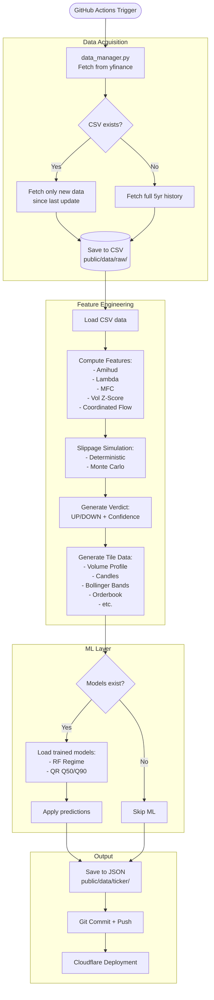

# Python Scripts Overview

This document provides a detailed explanation of each Python script in the `scripts/` directory.

## 🧠 ML Models & Data Dependencies

### Quick Reference

**Which Scripts Train Models?**  
✅ `train_regime_classifier.py` - Trains regime classification model (Weekly)  
✅ `train_slippage_quantile.py` - Trains slippage forecasting models (Weekly)  
❌ All other scripts do NOT train models

**Which Scripts Send Data to Dashboard?**  
✅ `tradyxa_pipeline.py` - Generates all dashboard tile data (Daily)  
✅ `apply_models.py` - Adds ML predictions to dashboard data (Daily)  
✅ `fetch_spot_prices.py` - Updates live spot prices only (Every 2 hours)  
❌ Training scripts do NOT send to dashboard (use `[skip ci]`)

**Dashboard Tile Dependencies:**
- **Tiles 1, 2, 4-12** - Use CSV-derived data (no ML models)
- **Tile 3 (Slippage)** - Enhanced with Q50/Q90 slippage model predictions
- **Tile 13 (Verdict)** - Enhanced with regime classifier + slippage predictions

📖 **See comprehensive documentation:** [../MODEL_TRAINING_AND_DATA_DEPENDENCIES.md](../MODEL_TRAINING_AND_DATA_DEPENDENCIES.md)

## Data Pipeline Flow



## Execution Patterns

| Script | Frequency | Purpose | Triggers Deployment? |
|--------|-----------|---------|----------------------|
| `tradyxa_pipeline.py` | **Daily (weekdays)** | Generate all market data | ✅ Yes |
| `apply_models.py` | **Daily (weekdays)** | Apply ML predictions | ✅ Yes (same commit) |
| `fetch_spot_prices.py` | **Every 2 hours** | Update spot prices only | ✅ Yes |
| `train_regime_classifier.py` | **Weekly (Sundays)** | Train regime model | ❌ No ([skip ci]) |
| `train_slippage_quantile.py` | **Weekly (Sundays)** | Train slippage models | ❌ No ([skip ci]) |
| `fetch_tickers.py` | **One-time/manual** | Fetch ticker list | ❌ No |
| `data_manager.py` | N/A (library) | Data utilities | N/A |

---

## **Core Data Pipeline**

### 1. `fetch_tickers.py`
**Purpose**: Fetch the list of NIFTY 500 stock symbols from NSE website

**What it does**:
- Downloads the official NIFTY 500 constituent list from NSE
- Adds NIFTY 50 (`^NSEI`) and BANKNIFTY (`^NSEBANK`) indices
- Saves all 503 tickers to `scripts/nifty500.txt`
- Uses a fallback list if the online source fails

**When to run**: 
- Initially (once)
- Weekly (to catch any index rebalancing)

**Command**:
```bash
python scripts/fetch_tickers.py
```

**Output**: `scripts/nifty500.txt` (503 ticker symbols)

---

### 1b. `fetch_spot_prices.py`
**Purpose**: Fetch ONLY current spot prices and India VIX (lightweight, real-time)

**What it does**:
- Fetches current spot price for all 503 stocks
- Fetches India VIX (volatility index)
- Saves to a single lightweight JSON file (~50 KB)
- **Does NOT update historical CSV files**

**When to run**: 
- Every 30 minutes during market hours (9:15 AM - 3:30 PM IST)
- Automated via GitHub Actions

**Command**:
```bash
python scripts/fetch_spot_prices.py
```

**Output**: `public/data/live/spot_prices.json` (current prices only)

**Use Case**: Real-time dashboard updates without heavy data processing

---

### 2. `data_manager.py`
**Purpose**: Handle data fetching and caching from yfinance

**What it does**:
- Fetches OHLCV (Open, High, Low, Close, Volume) data using yfinance
- Fetches OHLCV (Open, High, Low, Close, Volume) data using yfinance
- **Automatic History Management**:
  - New tickers: Fetches from **2005-01-01** by default
  - Existing data: Smartly appends new daily data (incremental update)
  - Backfilling: Automatically detects and fills missing historical data (e.g., if current file starts in 2010, it fetches 2005-2010)
- Saves data to CSV files in `public/data/raw/`
- Handles yfinance's MultiIndex column structure
- Provides timezone-aware date handling

**Key Functions**:
- `fetch_and_update_data()`: Main fetch function with incremental logic
- `load_data()`: Load existing CSV data
- `save_data()`: Save data to CSV

**Used by**: `tradyxa_pipeline.py`

---

### 3. `tradyxa_pipeline.py`
**Purpose**: Master orchestration script for the entire data processing pipeline

**What it does**:
1. **Fetches data** using `data_manager.py`
2. **Computes features** (amihud, lambda, MFC, volatility, etc.)
3. **Runs slippage simulations** (deterministic + Monte Carlo)
4. **Generates verdict** (UP/DOWN with confidence score)
5. **Saves JSON files** to `public/data/ticker/`

**Modes**:
- `run_all --ticker <TICKER>`: Process single ticker
- `batch_run --tickers-file <FILE>`: Process all tickers in parallel

**Command Examples**:
```bash
# Single ticker
python scripts/tradyxa_pipeline.py --mode run_all --ticker RELIANCE.NS

# All 503 tickers (parallel with 4 workers)
python scripts/tradyxa_pipeline.py --mode batch_run --tickers-file scripts/nifty500.txt --max-workers 4
```

**Output**:
- `public/data/raw/<TICKER>.csv` - OHLCV data
- `public/data/ticker/<TICKER>.json` - Features + metrics + verdict
- `public/data/ticker/<TICKER>_slippage.json` - Slippage stats
- `public/data/ticker/<TICKER>_monte_slippage.json` - Monte Carlo results

---

## **Machine Learning**

### 4. `train_regime_classifier.py`
**Purpose**: Train the execution regime classification model

**What it does**:
1. **Loads data** from ALL 503 ticker JSON files
2. **Combines** ~230k feature rows from all stocks
3. **Labels** each row based on slippage severity:
   - 0 = LOW (p90 slippage < 3%)
   - 1 = NORMAL (3% - 7%)
   - 2 = HIGH (7% - 15%)
   - 3 = SEVERE (> 15%)
4. **Trains** RandomForest classifier
5. **Saves** model to `models/rf_execution_regime.joblib`

**Command**:
```bash
python scripts/train_regime_classifier.py
```

**Output**:
- `models/rf_execution_regime.joblib` (trained model)
- `models/rf_execution_regime_metadata.json` (accuracy, features)

**When to run**: Weekly (after accumulating more data)

---

### 5. `train_slippage_quantile.py`
**Purpose**: Train slippage forecasting models

**What it does**:
1. **Loads data** from ALL 503 ticker JSON files
2. **Combines** ~230k feature rows
3. **Trains two models**:
   - Q50 (median slippage predictor)
   - Q90 (tail risk / worst-case predictor)
4. Uses GradientBoosting with quantile loss

**Command**:
```bash
python scripts/train_slippage_quantile.py
```

**Output**:
- `models/qr_slippage_q50.joblib`
- `models/qr_slippage_q90.joblib`

**When to run**: Weekly (same time as regime classifier)

---

### 6. `apply_models.py`
**Purpose**: Apply trained ML models to all ticker data

**What it does**:
1. **Loads** the 3 trained models
2. **Reads** each ticker's JSON file
3. **Extracts** latest feature row for each ticker
4. **Makes predictions**:
   - Regime classification (0-3)
   - Median slippage forecast
   - P90 slippage forecast
5. **Updates** each JSON with ML predictions

**Command**:
```bash
python scripts/apply_models.py
```

**When to run**: 
- After training models (weekly)
- After generating new data (daily)

**Updates**: All `public/data/ticker/*.json` files with predictions

---

## **Utility Scripts**

### 7. `sample_data_generator.py`
**Purpose**: Generate synthetic OHLCV data for testing

**What it does**:
- Creates realistic-looking stock price data
- Used as fallback when yfinance fails
- Implements random walk with volatility

**Used by**: `tradyxa_pipeline.py` (fallback only)

---

## **Complete Workflow**

### **Initial Setup** (One-time):
```bash
# 1. Fetch ticker list
python scripts/fetch_tickers.py

# 2. Generate data for all stocks
python scripts/tradyxa_pipeline.py --mode batch_run --tickers-file scripts/nifty500.txt --max-workers 4

# 3. Train models
python scripts/train_regime_classifier.py
python scripts/train_slippage_quantile.py

# 4. Apply models
python scripts/apply_models.py
```

### **Daily Updates** (Automated via GitHub Actions):
```bash
# 1. Update data (incremental fetch)
python scripts/tradyxa_pipeline.py --mode batch_run --tickers-file scripts/nifty500.txt --max-workers 2

# 2. Apply existing models
python scripts/apply_models.py
```

### **Weekly Training** (Automated via GitHub Actions):
```bash
# 1. Retrain models on all accumulated data
python scripts/train_regime_classifier.py
python scripts/train_slippage_quantile.py
```

---

## **Data Flow Summary**

```
fetch_tickers.py
    ↓
[nifty500.txt]
    ↓
tradyxa_pipeline.py (uses data_manager.py)
    ↓
[CSV files + JSON files with features]
    ↓
train_*.py (reads all JSONs)
    ↓
[Trained models]
    ↓
apply_models.py (reads models + JSONs)
    ↓
[Updated JSONs with predictions]
    ↓
Dashboard (reads JSONs)
```

---

## **Key Concepts**

**Incremental Updates**: `data_manager.py` only fetches new rows since last update, not full 5 years every time

**Bulk Training**: Models train on combined data from all 503 stocks (~230k rows total)

**Individual Predictions**: Trained models apply individually to each stock's current features

**Parallel Processing**: `tradyxa_pipeline.py` uses multi-threading to process stocks in parallel
