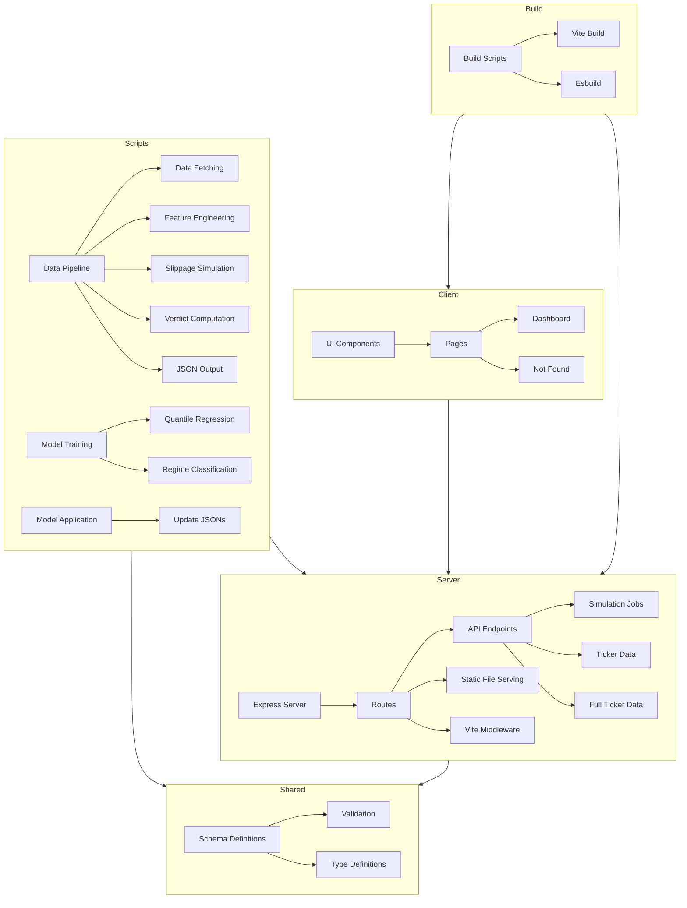

    

    <b>Automatic Architecture Diagrams from Code</b> 
    <a href="https://github.com/swark-io/swark">GitHub</a> • <a href="https://swark.io">Website</a> • <a href="mailto:contact@swark.io">Contact Us</a>

## Usage Instructions

1. **Render the Diagram**: Use the links below to open it in Mermaid Live Editor, or install the [Mermaid Support](https://marketplace.visualstudio.com/items?itemName=bierner.markdown-mermaid) extension.
2. **Recommended Model**: If available for you, use `claude-3.5-sonnet` [language model](vscode://settings/swark.languageModel). It can process more files and generates better diagrams.
3. **Iterate for Best Results**: Language models are non-deterministic. Generate the diagram multiple times and choose the best result.

## Generated Content
**Model**: GPT-4o - [Change Model](vscode://settings/swark.languageModel)  
**Mermaid Live Editor**: [View](https://mermaid.live/view#pako:eNp9VF1zmzAQ_CsanpM_4IfOYGNSu_VHjO22Ofwgwxk0FUIjpLaZTP57hQQ4OGnfrN2929Ny8kuQ1TkGkyAVhaKyJPsoFYQ05uyPM85Q6BYiJITDgszqStbCYs2J3N9_IlPY0gKbk5dMHTaDiDbluaYqH-ERrGtN4toIj6PIUzGyS1D9QuVr5jD_IxU2TYd6vxh2tdGDYezABwi3CzIXuaxZO9lb7jMkmmqWkZhxdK2YKEaKBRyZRrJiec7xN1XYsQ-OXULCKsNti1qQZX1uRuwX2LPsJyoSUU1HzFeIDefklv7gzqW1zH3pCpKsxIqSCC9MsNaz91u5rms4Us5yN82I2MD-WeK7ug_sMsWkbnztFtrByJZJ5Ez0F9-6jo-ei1Fn5TUyz-0gRqqNQht6YQtR3SoSSDiT0u4GueY3UuzhiCpnmXY7ZfR7xQGWyWZNNkZbumOOsLILa3NV1F7UmjrlN3g0VOj2C--waJfm2uvoFN_BEqxCu9HUsheWvfX70XUNpeQ948qe4CBt2kjaSf4V6dQw3n3AMAR36mM-9bDrFk79qjnJDTWDeXMe8MHEP0Af6fA4_C8PDtvTOf4PHRr4Gd1bHR74Fet1wV1Qoaooy-0fxEsaaLuamAYTkgY5XqjhOg1erci4iCJGbRxVMNHK4F1Aja6TZ5H1Z1WbogwmF8obfP0LehptlA) | [Edit](https://mermaid.live/edit#pako:eNp9VF1zmzAQ_CsanpM_4IfOYGNSu_VHjO22Ofwgwxk0FUIjpLaZTP57hQQ4OGnfrN2929Ny8kuQ1TkGkyAVhaKyJPsoFYQ05uyPM85Q6BYiJITDgszqStbCYs2J3N9_IlPY0gKbk5dMHTaDiDbluaYqH-ERrGtN4toIj6PIUzGyS1D9QuVr5jD_IxU2TYd6vxh2tdGDYezABwi3CzIXuaxZO9lb7jMkmmqWkZhxdK2YKEaKBRyZRrJiec7xN1XYsQ-OXULCKsNti1qQZX1uRuwX2LPsJyoSUU1HzFeIDefklv7gzqW1zH3pCpKsxIqSCC9MsNaz91u5rms4Us5yN82I2MD-WeK7ug_sMsWkbnztFtrByJZJ5Ez0F9-6jo-ei1Fn5TUyz-0gRqqNQht6YQtR3SoSSDiT0u4GueY3UuzhiCpnmXY7ZfR7xQGWyWZNNkZbumOOsLILa3NV1F7UmjrlN3g0VOj2C--waJfm2uvoFN_BEqxCu9HUsheWvfX70XUNpeQ948qe4CBt2kjaSf4V6dQw3n3AMAR36mM-9bDrFk79qjnJDTWDeXMe8MHEP0Af6fA4_C8PDtvTOf4PHRr4Gd1bHR74Fet1wV1Qoaooy-0fxEsaaLuamAYTkgY5XqjhOg1erci4iCJGbRxVMNHK4F1Aja6TZ5H1Z1WbogwmF8obfP0LehptlA)

